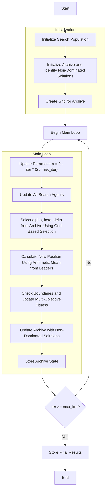

# Multi-Objective Grey Wolf Optimizer Algorithm Flowchart



### Detailed Step-by-Step Explanation:

1. **Initialize Search Population**:
   - Randomly generate initial positions within the search space
   - Each position X_i ∈ [lb, ub]^dim
   - Calculate multi-dimensional objective function values objective_func(X_i)

2. **Initialize Archive and Identify Non-Dominated Solutions**:
   - Identify non-dominated solutions from the initial population
   - Add non-dominated solutions to the archive
   ```python
   self._determine_domination(population)
   non_dominated = self._get_non_dominated_particles(population)
   self.archive.extend(non_dominated)
   ```

3. **Create Grid for Archive**:
   - Create hypercubes to manage the archive
   - Assign grid indices to each solution in the archive
   ```python
   self.grid = self._create_hypercubes(costs)
   particle.grid_index, particle.grid_sub_index = self._get_grid_index(particle)
   ```

4. **Main Loop** (max_iter times):
   - **Update Parameter a**:
     * Linearly decreases from 2 to 0 based on iteration count
     ```python
     a = 2 - iter * (2 / max_iter)
     ```

   - **Select alpha, beta, delta from Archive**:
     * Use grid-based selection to choose leaders
     * If insufficient leaders, supplement with random population members
     ```python
     leaders = self._select_multiple_leaders(3)
     ```

   - **Calculate New Position Using Arithmetic Mean**:
     * Each leader contributes equally (no weighting)
     * Sum contributions from all leaders and take the average
     ```python
     new_position[j] += X
     new_position[j] /= len(leaders)
     ```

   - **Check Boundaries and Update Multi-Objective Fitness**:
     * Ensure positions remain within bounds [lb, ub]
     * Recalculate multi-dimensional objective function values

   - **Update Archive with Non-Dominated Solutions**:
     * Add new non-dominated solutions to the archive
     * Maintain archive size by removing redundant solutions

   - **Store Archive State**:
     * Save archive state at each iteration to track progress

5. **Termination**:
   - Store final results (archive containing Pareto front set)
   - Display optimization history
   - Return archive and history