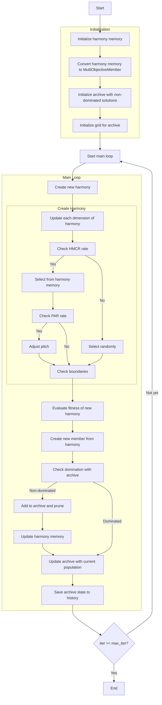

# Multi-Objective Harmony Search Optimizer Algorithm Flowchart



### Detailed Explanation of Steps:

1. **Initialize harmony memory**:
   - Initialize harmony memory with HMS size
   - Create initial random solutions
   ```python
   self.harmony_memory = np.zeros((self.hms, self.dim))
   for i in range(self.hms):
       position = np.random.uniform(self.lb, self.ub, self.dim)
       fitness = self.objective_func(position)
       self.harmony_memory[i] = position
       self.harmony_fitness.append(fitness)
   ```

2. **Convert harmony memory to MultiObjectiveMember**:
   - Convert harmonies to MultiObjectiveMember objects
   ```python
   population = []
   for i in range(self.hms):
       member = MultiObjectiveMember(self.harmony_memory[i].copy(), np.array(self.harmony_fitness[i]))
       population.append(member)
   ```

3. **Initialize archive with non-dominated solutions**:
   - Identify non-dominated solutions in harmony memory
   - Add these solutions to archive

4. **Initialize grid for archive**:
   - Create hypercubes to manage archive
   - Assign grid index to each solution in archive

5. **Create new harmony**:
   - Create a new harmony for each iteration

6. **Update each dimension of harmony**:
   - Iterate through each dimension of the search space

7. **Check HMCR (Harmony Memory Considering Rate)**:
   - If random number < HMCR, select from harmony memory
   - Otherwise, select randomly
   ```python
   if np.random.random() < self.hmcr:
   ```

8. **Select from harmony memory**:
   - Randomly select a harmony from memory
   ```python
   harmony_idx = np.random.randint(0, self.hms)
   new_harmony[j] = self.harmony_memory[harmony_idx, j]
   ```

9. **Check PAR (Pitch Adjustment Rate)**:
   - If random number < PAR, adjust pitch
   ```python
   if np.random.random() < self.par:
   ```

10. **Adjust pitch**:
    - Add noise to the selected value
    ```python
    new_harmony[j] += self.bw * (2 * np.random.random() - 1)
    ```

11. **Select randomly**:
    - Select random value within allowed boundaries
    ```python
    new_harmony[j] = np.random.uniform(self.lb[j], self.ub[j])
    ```

12. **Check boundaries**:
    - Ensure harmony stays within [lb, ub] boundaries
    ```python
    new_harmony = np.clip(new_harmony, self.lb, self.ub)
    ```

13. **Evaluate fitness of new harmony**:
    - Calculate multi-objective fitness values
    ```python
    new_fitness = self.objective_func(new_harmony)
    ```

14. **Create new member from harmony**:
    - Create MultiObjectiveMember object from new harmony
    ```python
    new_member = MultiObjectiveMember(new_harmony.copy(), np.array(new_fitness))
    ```

15. **Check domination with archive**:
    - Check if new harmony is dominated by archive
    - If non-dominated, add to archive

16. **Add to archive and prune**:
    - Add new harmony to archive
    - Prune archive if exceeding size
    ```python
    self.archive.append(new_member.copy())
    self._trim_archive()
    ```

17. **Update harmony memory**:
    - Replace worst harmony in memory with new harmony
    ```python
    replace_idx = np.random.randint(0, self.hms)
    self.harmony_memory[replace_idx] = new_harmony.copy()
    self.harmony_fitness[replace_idx] = new_fitness
    population[replace_idx] = new_member
    ```

18. **Update archive with current population**:
    - Add non-dominated solutions from current population to archive
    ```python
    self._add_to_archive(population)
    ```

19. **Save archive state to history**:
    - Store copy of archive at each iteration

20. **End**:
    - Return archive history and final archive
    - Display optimization results

### Important Parameters:
- **HMS**: Harmony memory size
- **HMCR**: Harmony memory considering rate (0.0-1.0)
- **PAR**: Pitch adjustment rate (0.0-1.0)
- **BW**: Bandwidth for pitch adjustment