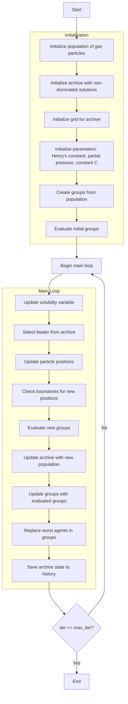

# Multi-Objective Henry Gas Solubility Optimizer Algorithm Flowchart



### Detailed Step-by-Step Explanation:

1. **Initialize population of gas particles**:
   - Randomly generate initial positions within the search space
   - Each particle has position X_i ∈ [lb, ub]^dim

2. **Initialize archive with non-dominated solutions**:
   - Identify non-dominated solutions in the initial population
   - Add these solutions to the archive

3. **Initialize grid for archive**:
   - Create hypercubes to manage the archive
   - Assign grid indices to each solution in the archive

4. **Initialize parameters: Henry's constant, partial pressure, constant C**:
   - Initialize physical parameters for the gas dissolution model
   ```python
   K = self.l1 * np.random.rand(self.n_types)  # Henry's constants
   P = self.l2 * np.random.rand(search_agents_no)  # Partial pressures
   C = self.l3 * np.random.rand(self.n_types)  # Constants
   ```

5. **Create groups from population**:
   - Divide the population into groups based on gas types
   ```python
   group_size = len(population) // self.n_types
   groups = [[] for _ in range(self.n_types)]
   ```

6. **Evaluate initial groups**:
   - Calculate multi-objective fitness for each group
   - Determine best member for each group
   ```python
   for i in range(self.n_types):
       groups[i], group_best_members[i] = self._evaluate_group_multi(groups[i], None, True)
   ```

7. **Update solubility variable**:
   - Calculate temperature and update Henry's constant
   - Calculate solubility for each particle
   ```python
   T = np.exp(-iter / max_iter)  # Temperature
   K[j] = K[j] * np.exp(-C[j] * (1/T - 1/T0))
   S[start_idx:end_idx] = P[start_idx:end_idx] * K[j]
   ```

8. **Select leader from archive**:
   - Use grid-based selection to choose a leader from the archive
   - If archive is empty, use best member from the first group

9. **Update particle positions**:
   - Update positions based on influence from group best and leader
   - Calculate gamma parameter based on fitness
   ```python
   gamma = self.beta * np.exp(-(leader_fitness + 0.05) / (current_fitness + 0.05))
   new_position[k] += group_best_influence + leader_influence
   ```

10. **Check boundaries for new positions**:
    - Ensure particle positions remain within [lb, ub] boundaries
    ```python
    groups[i][j].position = np.clip(groups[i][j].position, self.lb, self.ub)
    ```

11. **Evaluate new groups**:
    - Calculate multi-objective fitness for new groups
    - Update best member for each group

12. **Update archive with new population**:
    - Add new non-dominated solutions to the archive
    - Remove dominated solutions
    ```python
    self._add_to_archive(new_population)
    ```

13. **Update groups with evaluated groups**:
    - Update groups with new fitness and position information

14. **Replace worst agents in groups**:
    - Determine number of worst agents to replace
    - Replace worst agents with new random positions
    ```python
    Nw = int(round((M2N - M1N) * np.random.random() + M1N))
    ```

15. **Save archive state to history**:
    - Store a copy of the archive at each iteration
    ```python
    history_archive.append([member.copy() for member in self.archive])
    ```

16. **End**:
    - Return archive history and final archive
    - Display optimization results

### Important Physical Formulas:

#### Henry's Law:
```python
# Henry's constant update
K[j] = K[j] * np.exp(-C[j] * (1/T - 1/T0))

# Solubility calculation
S = P * K  # Solubility = Partial Pressure × Henry's Constant
```

#### Position Update:
```python
# Group best influence
group_best_influence = direction_flag * np.random.random() * gamma * (group_best.position[k] - current.position[k])

# Leader influence  
leader_influence = np.random.random() * self.alpha * direction_flag * (S * leader.position[k] - current.position[k])

# Total update
new_position[k] += group_best_influence + leader_influence
```

### Important Parameters:
- **n_types**: Number of gas types (number of groups)
- **l1, l2, l3**: Constants for Henry's constant, partial pressure, and constant C
- **alpha, beta**: Position update constants
- **M1, M2**: Percentage of worst agents to replace
- **archive_size**: Archive size

### Features of Multi-Objective HGSO:
- Simulates Henry's law of gas dissolution in liquids
- Uses multiple groups to maintain diversity
- Combines influence from group best and archive leader
- Automatically replaces worst agents to avoid local optima
- Archive management for multi-objective optimization