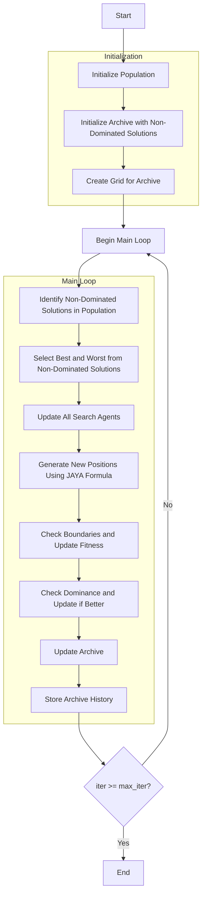

# Multi-Objective JAYA Optimizer Algorithm Flowchart



### Detailed Explanation of Steps:

1. **Initialize Population**:
   - Randomly generate initial positions within the search space
   - Each position X_i ∈ [lb, ub]^dim
   - Calculate multi-objective fitness value = objective_func(X_i)

2. **Initialize Archive with Non-Dominated Solutions**:
   - Identify non-dominated solutions in the initial population
   - Add these solutions to the external archive

3. **Create Grid for Archive**:
   - Create hypercube grid to manage the archive
   - Assign grid indices to each solution in the archive

4. **Main Loop** (max_iter times):
   - **Identify Non-Dominated Solutions in Population**:
     * Use `_determine_domination()` method to determine dominance
     * Extract non-dominated solutions using `_get_non_dominated_particles()`

   - **Select Best and Worst from Non-Dominated Solutions**:
     * Use grid-based selection to choose 2 leaders from archive
     * If insufficient leaders, use random selection
     ```python
     leaders = self._select_multiple_leaders(2)
     best_member = leaders[0]
     worst_member = leaders[1]
     ```

   - **Update All Search Agents**:
     * Iterate through each agent in the population

   - **Generate New Positions Using JAYA Formula**:
     * Apply JAYA formula for each dimension:
     ```python
     new_position[j] = (
         population[i].position[j] + 
         rand1 * (best_member.position[j] - abs(population[i].position[j])) - 
         rand2 * (worst_member.position[j] - abs(population[i].position[j]))
     )
     ```

   - **Check Boundaries and Update Fitness**:
     * Ensure positions remain within bounds [lb, ub] using `np.clip()`
     * Recalculate objective function values

   - **Check Dominance and Update if Better**:
     * Use `_dominates()` to check if new solution is better than current solution
     * If better, update position and fitness

   - **Update Archive**: Add new non-dominated solutions to the archive
   
   - **Store Archive History**: Save current archive state

5. **End**:
   - Save final results
   - Return archive history and final archive