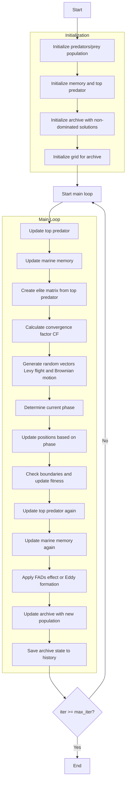

# Multi-Objective Marine Predators Optimizer Algorithm Flowchart



### Detailed Step-by-Step Explanation:

1. **Initialize predators/prey population**:
   - Randomly generate initial positions within the search space
   - Each predator/prey has position X_i ∈ [lb, ub]^dim

2. **Initialize memory and top predator**:
   - Initialize memory for previous population and fitness
   - Initialize top predator with default values
   ```python
   Prey_old = [member.copy() for member in population]
   fit_old = np.array([member.multi_fitness for member in population])
   Top_predator_pos = np.zeros(self.dim)
   ```

3. **Initialize archive with non-dominated solutions**:
   - Identify non-dominated solutions in the initial population
   - Add these solutions to the archive

4. **Initialize grid for archive**:
   - Create hypercubes to manage the archive
   - Assign grid indices to each solution in the archive

5. **Update top predator**:
   - Find the best predator based on Pareto dominance
   - Update top predator position and fitness
   ```python
   if self._dominates(member, MultiObjectiveMember(Top_predator_pos, Top_predator_fit)):
       Top_predator_fit = member.multi_fitness.copy()
       Top_predator_pos = member.position.copy()
   ```

6. **Update marine memory**:
   - Compare current population with memory
   - Retain better solutions from memory
   ```python
   if self._dominates(old_member, population[i]):
       Inx[i] = True
   ```

7. **Create elite matrix from top predator**:
   - Create elite matrix by replicating top predator
   ```python
   Elite = np.tile(Top_predator_pos, (search_agents_no, 1))
   ```

8. **Calculate convergence factor CF**:
   - Compute decreasing convergence factor based on iteration
   ```python
   CF = (1 - iter / max_iter) ** (2 * iter / max_iter)
   ```

9. **Generate random vectors Levy flight and Brownian motion**:
   - Generate random vectors for Levy flight and Brownian motion
   ```python
   RL = 0.05 * self._levy_flight(search_agents_no, self.dim, 1.5)
   RB = np.random.randn(search_agents_no, self.dim)
   ```

10. **Determine current phase**:
    - Determine phase based on iteration count:
      - **Phase 1**: iter < max_iter/3 (High velocity ratio)
      - **Phase 2**: max_iter/3 < iter < 2*max_iter/3 (Unit velocity ratio)
      - **Phase 3**: iter > 2*max_iter/3 (Low velocity ratio)

11. **Update positions based on phase**:
    - **Phase 1**: Brownian motion with high exploration
    - **Phase 2**: Mixed strategy (Brownian + Levy flight)
    - **Phase 3**: Levy flight with high exploitation

12. **Check boundaries and update fitness**:
    - Ensure positions remain within bounds [lb, ub]
    - Calculate new multi-objective fitness values
    ```python
    member.position = np.clip(member.position, self.lb, self.ub)
    member.multi_fitness = self.objective_func(member.position)
    ```

13. **Apply FADs effect or Eddy formation**:
    - With FADs probability, apply Fish Aggregating Devices effect
    - Otherwise, apply Eddy formation effect
    ```python
    if np.random.random() < self.FADs:
        # FADs effect
        U = np.random.rand(search_agents_no, self.dim) < self.FADs
        random_positions = Xmin + np.random.rand(search_agents_no, self.dim) * (Xmax - Xmin)
        positions = positions + CF * random_positions * U
    else:
        # Eddy formation effect
        r = np.random.random()
        stepsize = (self.FADs * (1 - r) + r) * (positions[idx1] - positions[idx2])
        positions = positions + stepsize
    ```

14. **Update archive with new population**:
    - Add new non-dominated solutions to the archive
    - Remove dominated solutions
    ```python
    self._add_to_archive(population)
    ```

15. **Save archive state to history**:
    - Store a copy of the archive at each iteration
    ```python
    history_archive.append([member.copy() for member in self.archive])
    ```

16. **End**:
    - Return archive history and final archive
    - Display optimization results

### MPA Phases:

#### Phase 1 (High Velocity Ratio - Exploration):
```python
# Brownian motion with high exploration
stepsize = RB[i, j] * (Elite[i, j] - RB[i, j] * positions[i, j])
positions[i, j] = positions[i, j] + self.P * R * stepsize
```

#### Phase 2 (Unit Velocity Ratio - Balanced):
```python
# Mixed strategy: Brownian + Levy flight
if i > search_agents_no / 2:
    stepsize = RB[i, j] * (RB[i, j] * Elite[i, j] - positions[i, j])
    positions[i, j] = Elite[i, j] + self.P * CF * stepsize
else:
    stepsize = RL[i, j] * (Elite[i, j] - RL[i, j] * positions[i, j])
    positions[i, j] = positions[i, j] + self.P * R * stepsize
```

#### Phase 3 (Low Velocity Ratio - Exploitation):
```python
# Levy flight with high exploitation
stepsize = RL[i, j] * (RL[i, j] * Elite[i, j] - positions[i, j])
positions[i, j] = Elite[i, j] + self.P * CF * stepsize
```

### Important Parameters:
- **FADs**: Fish Aggregating Devices effect probability
- **P**: Memory rate parameter
- **CF**: Convergence factor (decreases with iteration)
- **archive_size**: Archive size

### Multi-Objective MPA Features:
- Simulates marine predator hunting behavior
- 3 phases with different movement strategies
- Uses Levy flight and Brownian motion
- Memory mechanism to store good solutions
- Archive management for multi-objective optimization
- FADs effect and Eddy formation to avoid local optima