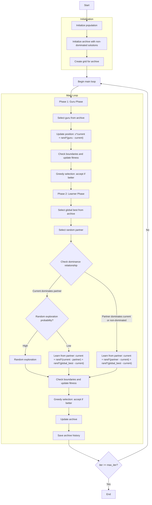

# Multi-Objective Modified Social Group Optimizer Algorithm Flowchart



### Detailed Explanation of Steps:

1. **Initialize population**:
   - Randomly generate initial positions within the search space
   - Each position X_i ∈ [lb, ub]^dim
   - Calculate multi-objective fitness values: multi_fitness = objective_func(X_i)

2. **Initialize archive with non-dominated solutions**:
   - Identify non-dominated solutions in the initial population
   - Add these solutions to the external archive

3. **Create grid for archive**:
   - Create hypercube grid to manage the archive
   - Assign grid indices to each solution in the archive

4. **Main loop** (max_iter times):
   - **Phase 1: Guru Phase** (learning from the best):
     * Select guru from archive using grid-based selection
     * Update position:
       ```python
       new_position[j] = c * current.position[j] + random * (guru.position[j] - current.position[j])
       ```
     * Check boundaries and update fitness
     * Greedy selection: accept new solution if it dominates the current solution or is non-dominated
   
   - **Phase 2: Learner Phase** (mutual learning with random exploration):
     * Select global best from archive
     * Select random partner different from current individual
     * Check dominance relationship between current and partner:
       - If current dominates partner and is not dominated by partner:
         * If random > sap (0.7): learn from partner
           ```python
           new_position = current + random*(current - partner) + random*(global_best - current)
           ```
         * Else: random exploration
       - Else (partner dominates current or non-dominated): learn from partner
         ```python
         new_position = current + random*(partner - current) + random*(global_best - current)
         ```
     * Check boundaries and update fitness
     * Greedy selection: accept new solution if better
   
   - **Update archive**: Add new non-dominated solutions to archive
   
   - **Save archive history**: Record current archive state

5. **End**:
   - Save final results
   - Return archive history and final archive