# Multi-Objective Moss Growth Optimizer Algorithm Flowchart

```mermaid
flowchart TD
    A["Start"] --> B["Initialize Population"]
    B --> C["Initialize Archive with Non-Dominated Solutions"]
    C --> D["Create Grid for Archive"]
    D --> E["Initialize Cryptobiosis Mechanism"]
    E --> F["Begin Main Loop"]
    F --> G["Calculate Progress Ratio"]
    G --> H["Record Initial Generation for Cryptobiosis"]
    H --> I["Process Each Search Agent"]
    I --> J["Select Leader from Archive"]
    J --> K["Select Calculation Region Based on Majority"]
    K --> L["Calculate Distance to Leader"]
    L --> M["Calculate Average Wind Direction"]
    M --> N["Calculate Beta and Gamma Parameters"]
    N --> O["Calculate Movement Step Size"]
    O --> P{"Spore Dispersion Probability?"}
    P -- "High" --> Q["Spore Dispersion Search: position + step * D_wind"]
    P -- "Low" --> R["Alternative Spore Dispersion Search: position + step2 * D_wind"]
    Q --> S{"Double Propagation Probability?"}
    R --> S
    S -- "Yes" --> T{"Update Individual Dimension?"}
    S -- "No" --> U["Update All Dimensions with Activation Function"]
    T -- "Yes" --> V["Update Specific Dimension: leader.position + step3 * D_wind[dim]"]
    T -- "No" --> U
    V --> W["Check Boundaries and Update Fitness"]
    U --> W
    W --> X["Record History for Cryptobiosis"]
    X --> Y{"Sufficient Records or Final Iteration?"}
    Y -- "Yes" --> Z["Apply Cryptobiosis Mechanism"]
    Y -- "No" --> AA["Increment Record Counter"]
    Z --> AB["Update Archive"]
    AA --> AB
    AB --> AC["Archive History Storage"]
    AC --> AD{"iter >= max_iter?"}
    AD -- "Not Yet" --> F
    AD -- "Yes" --> AE["End"]
    
    subgraph Initialization
    B
    C
    D
    E
    end
    
    subgraph Main Loop
    G
    H
    I
    J
    K
    L
    M
    N
    O
    P
    Q
    R
    S
    T
    U
    V
    W
    X
    Y
    Z
    AA
    AB
    AC
    end
```



### Detailed Explanation of Steps:

1. **Initialize Population**:
   - Randomly generate initial positions within the search space
   - Each position X_i ∈ [lb, ub]^dim
   - Calculate multi-objective function values: multi_fitness = objective_func(X_i)

2. **Initialize Archive with Non-Dominated Solutions**:
   - Identify non-dominated solutions in the initial population
   - Add these solutions to the external archive

3. **Create Grid for Archive**:
   - Create hypercube grid to manage the archive
   - Assign grid indices to each solution in the archive

4. **Initialize Cryptobiosis Mechanism**:
   - Initialize arrays to store position and fitness history
   - Initialize record counter

5. **Main Loop** (max_iter times):
   - **Calculate Progress Ratio**: progress_ratio = current_fes / max_fes
   
   - **Record Initial Generation for Cryptobiosis**: Store initial positions and fitness
   
   - **Process Each Search Agent**:
     * Select leader from archive using grid-based selection
     * Select calculation region based on majority of individuals
     * Calculate distance to leader and average wind direction:
       ```python
       D = leader.position - cal_positions
       D_wind = np.mean(D, axis=0)
       ```
     * Calculate beta and gamma parameters:
       ```python
       beta = cal_positions.shape[0] / search_agents_no
       gamma = 1 / sqrt(1 - beta**2) if beta < 1 else 1.0
       ```
     * Calculate movement step size with time-based decay
   
   - **Search Strategy**:
     * If random > d1 (0.2): main spore dispersion
       ```python
       new_position = current.position + step * D_wind
       ```
     * Else: alternative spore dispersion
       ```python
       new_position = current.position + step2 * D_wind
       ```
     * If random < 0.8: double propagation
       - If random > 0.5: update individual dimension
         ```python
         new_position[dim_idx] = leader.position[dim_idx] + step3 * D_wind[dim_idx]
         ```
       - Else: update all dimensions with activation function
         ```python
         new_position = (1 - act) * new_position + act * leader.position
         ```
   
   - **Check Boundaries and Update Fitness**
   
   - **Record History for Cryptobiosis**: Store current positions and fitness
   
   - **Apply Cryptobiosis Mechanism** when sufficient records are available:
     * Find best historical position using Pareto dominance
     * Update current position with best historical position
   
   - **Update Archive**: Add new non-dominated solutions to archive
   
   - **Archive History Storage**: Store current archive state

6. **End**:
   - Store final results
   - Return archive history and final archive