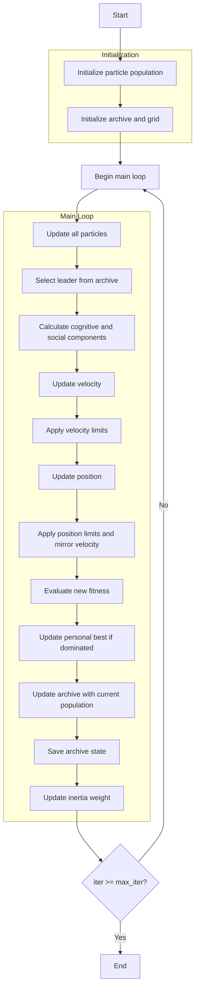

# Multi-Objective Particle Swarm Optimizer Algorithm Flowchart



### Detailed Explanation of Steps:

1. **Initialize particle population**:
   - Randomly generate initial positions within the search space
   - Initialize random velocities within allowed limits
   - Each position X_i ∈ [lb, ub]^dim
   - Calculate multi-objective function values
   - Initialize personal best for each particle

2. **Initialize archive and grid**:
   - Identify non-dominated solutions from the initial population
   - Initialize archive with non-dominated solutions
   - Create grid to manage archive based on objective space

3. **Main loop** (max_iter times):
   - **Update all particles**:
     * Each particle updates position based on velocity

   - **Select leader from archive**:
     * Use grid-based selection to choose leader from archive
     * If archive is empty, randomly select from population

   - **Calculate cognitive and social components**:
     * Cognitive component: direction toward personal best
     * Social component: direction toward leader from archive
     ```python
     cognitive_component = self.c1 * r1 * (particle.personal_best_position - particle.position)
     social_component = self.c2 * r2 * (leader.position - particle.position)
     ```

   - **Update velocity**:
     * Combine inertia, cognitive and social components
     ```python
     particle.velocity = (self.w * particle.velocity + 
                        cognitive_component + 
                        social_component)
     ```

   - **Apply velocity limits**:
     * Ensure velocity stays within [vel_min, vel_max]

   - **Update position**:
     * Move particle according to velocity
     ```python
     new_position = particle.position + particle.velocity
     ```

   - **Apply position limits and mirror velocity**:
     * Ensure position stays within [lb, ub]
     * If out of bounds, reverse velocity
     ```python
     outside_bounds = (new_position < self.lb) | (new_position > self.ub)
     particle.velocity[outside_bounds] = -particle.velocity[outside_bounds]
     new_position = np.clip(new_position, self.lb, self.ub)
     ```

   - **Evaluate new fitness**:
     * Recalculate multi-objective function values

   - **Update personal best if dominated**:
     * Update personal best if current position dominates personal best (Pareto dominance)
     ```python
     if self._dominates_personal_best(particle):
         particle.personal_best_position = particle.position.copy()
         particle.personal_best_fitness = particle.multi_fitness.copy()
     ```

   - **Update archive with current population**:
     * Add non-dominated solutions to archive
     * Maintain archive size by removing redundant solutions
     * Update grid to reflect new archive

   - **Save archive state**:
     * Store current archive for optimization history

   - **Update inertia weight**:
     * Decrease inertia weight over time to transition from exploration to exploitation
     ```python
     self.w *= self.wdamp
     ```

4. **End**:
   - Store final results
   - Return archive (set of Pareto optimal solutions) and history