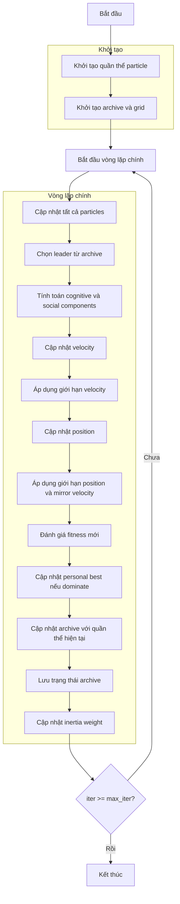

# Sơ đồ thuật toán Multi-Objective Particle Swarm Optimizer



### Giải thích chi tiết các bước:

1. **Khởi tạo quần thể particle**: 
   - Tạo ngẫu nhiên các vị trí ban đầu trong không gian tìm kiếm
   - Khởi tạo velocity ngẫu nhiên trong giới hạn cho phép
   - Mỗi vị trí X_i ∈ [lb, ub]^dim
   - Tính toán giá trị hàm mục tiêu đa mục tiêu
   - Khởi tạo personal best cho mỗi particle

2. **Khởi tạo archive và grid**:
   - Xác định các giải pháp không bị chi phối từ quần thể ban đầu
   - Khởi tạo archive với các giải pháp không bị chi phối
   - Tạo grid để quản lý archive dựa trên không gian mục tiêu

3. **Vòng lặp chính** (max_iter lần):
   - **Cập nhật tất cả particles**:
     * Mỗi particle cập nhật vị trí dựa trên velocity

   - **Chọn leader từ archive**:
     * Sử dụng lựa chọn dựa trên grid để chọn leader từ archive
     * Nếu archive rỗng, chọn ngẫu nhiên từ quần thể

   - **Tính toán cognitive và social components**:
     * Cognitive component: hướng về personal best
     * Social component: hướng về leader từ archive
     ```python
     cognitive_component = self.c1 * r1 * (particle.personal_best_position - particle.position)
     social_component = self.c2 * r2 * (leader.position - particle.position)
     ```

   - **Cập nhật velocity**:
     * Kết hợp inertia, cognitive và social components
     ```python
     particle.velocity = (self.w * particle.velocity + 
                        cognitive_component + 
                        social_component)
     ```

   - **Áp dụng giới hạn velocity**:
     * Đảm bảo velocity nằm trong [vel_min, vel_max]

   - **Cập nhật position**:
     * Di chuyển particle theo velocity
     ```python
     new_position = particle.position + particle.velocity
     ```

   - **Áp dụng giới hạn position và mirror velocity**:
     * Đảm bảo position nằm trong [lb, ub]
     * Nếu vượt biên, đảo ngược velocity
     ```python
     outside_bounds = (new_position < self.lb) | (new_position > self.ub)
     particle.velocity[outside_bounds] = -particle.velocity[outside_bounds]
     new_position = np.clip(new_position, self.lb, self.ub)
     ```

   - **Đánh giá fitness mới**:
     * Tính toán lại giá trị hàm mục tiêu đa mục tiêu

   - **Cập nhật personal best nếu dominate**:
     * Cập nhật personal best nếu vị trí hiện tại dominate personal best (theo Pareto)
     ```python
     if self._dominates_personal_best(particle):
         particle.personal_best_position = particle.position.copy()
         particle.personal_best_fitness = particle.multi_fitness.copy()
     ```

   - **Cập nhật archive với quần thể hiện tại**:
     * Thêm các giải pháp không bị chi phối vào archive
     * Duy trì kích thước archive bằng cách loại bỏ các giải pháp dư thừa
     * Cập nhật grid để phản ánh archive mới

   - **Lưu trạng thái archive**:
     * Lưu trữ archive hiện tại cho lịch sử tối ưu hóa

   - **Cập nhật inertia weight**:
     * Giảm inertia weight theo thời gian để chuyển từ khám phá sang khai thác
     ```python
     self.w *= self.wdamp
     ```

4. **Kết thúc**:
   - Lưu trữ kết quả cuối cùng
   - Trả về archive (tập các giải pháp Pareto tối ưu) và lịch sử
