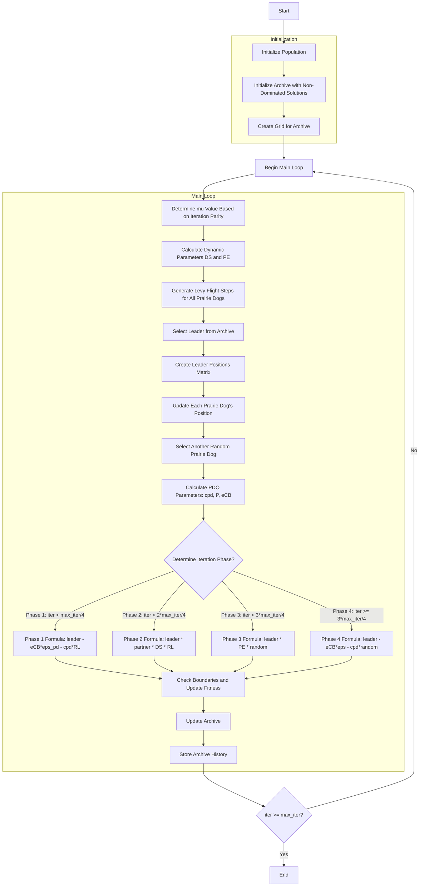

# Algorithm Flowchart for Multi-Objective Prairie Dogs Optimizer



### Detailed Step-by-Step Explanation:

1. **Initialize Population**:
   - Randomly generate initial positions within the search space
   - Each position X_i ∈ [lb, ub]^dim
   - Calculate multi-objective fitness values: multi_fitness = objective_func(X_i)

2. **Initialize Archive with Non-Dominated Solutions**:
   - Identify non-dominated solutions in the initial population
   - Add these solutions to the external archive

3. **Create Grid for Archive**:
   - Create hypercube grid to manage the archive
   - Assign grid indices to each solution in the archive

4. **Main Loop** (max_iter times):
   - **Determine mu value based on iteration parity**:
     ```python
     mu = -1 if (iter + 1) % 2 == 0 else 1
     ```
   
   - **Calculate dynamic parameters DS and PE**:
     * DS (Digging Strength): Burrowing strength parameter
     * PE (Predator Effect): Predator influence parameter
     ```python
     DS = 1.5 * np.random.randn() * (1 - iter/max_iter) ** (2 * iter/max_iter) * mu
     PE = 1.5 * (1 - iter/max_iter) ** (2 * iter/max_iter) * mu
     ```
   
   - **Generate Levy flight steps for all prairie dogs**: Create Levy flight jumps
     ```python
     RL = np.array([self._levy_flight() for _ in range(search_agents_no)])
     ```
   
   - **Select leader from archive**: Choose leader using grid-based selection
   
   - **Create leader positions matrix**: Create matrix containing leader positions for all prairie dogs
     ```python
     TPD = np.tile(leader.position, (search_agents_no, 1))
     ```
   
   - **Update each prairie dog's position**: Iterate through each prairie dog for position update
   
   - **Select another random prairie dog**: Choose a different prairie dog for comparison
   
   - **Calculate PDO parameters**:
     * cpd: Individual difference parameter
     * P: Relative position parameter
     * eCB: Leader-based correction parameter
     ```python
     cpd = np.random.rand() * (TPD[i, j] - population[k].position[j]) / (TPD[i, j] + self.eps)
     P = self.rho + (population[i].position[j] - np.mean(population[i].position)) / (TPD[i, j] * (self.ub[j] - self.lb[j]) + self.eps)
     eCB = leader.position[j] * P
     ```
   
   - **Determine iteration phase and apply corresponding formula**:
     * **Phase 1 (0-25%)**: Strong exploration
       ```python
       new_position[j] = leader.position[j] - eCB * self.eps_pd - cpd * RL[i, j]
       ```
     * **Phase 2 (25-50%)**: Combined exploration and exploitation
       ```python
       new_position[j] = leader.position[j] * population[k].position[j] * DS * RL[i, j]
       ```
     * **Phase 3 (50-75%)**: Strong exploitation
       ```python
       new_position[j] = leader.position[j] * PE * np.random.rand()
       ```
     * **Phase 4 (75-100%)**: Final refinement
       ```python
       new_position[j] = leader.position[j] - eCB * self.eps - cpd * np.random.rand()
       ```
   
   - **Check boundaries and update fitness**: Ensure positions are within bounds and calculate new fitness
   
   - **Update archive**: Add new non-dominated solutions to the archive
   
   - **Store archive history**: Save current archive state

5. **End**:
   - Store final results
   - Return archive history and final archive

### PDO Parameters:

**Main Parameters**:
- `rho` (0.005): Account for individual PD difference
- `eps_pd` (0.1): Food source alarm parameter  
- `eps` (1e-10): Small epsilon for numerical stability
- `beta` (1.5): Levy flight parameter

**Dynamic Parameters**:
- `DS`: Digging Strength - changes with iteration
- `PE`: Predator Effect - changes with iteration
- `mu`: Coefficient based on iteration parity

**Levy Flight**:
- Uses `levy_flight()` function from `_general.py`
- Enhances search space exploration capability
- Particularly effective in the early stages of the algorithm