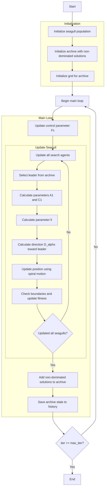

# Multi-Objective Seagull Optimizer Algorithm Flowchart



### Detailed Step-by-Step Explanation:

1. **Initialize seagull population**:
   - Randomly generate initial positions within the search space
   - Each seagull has position X_i ∈ [lb, ub]^dim

2. **Initialize archive with non-dominated solutions**:
   - Identify non-dominated solutions in the initial population
   - Add these solutions to the archive

3. **Initialize grid for archive**:
   - Create hypercubes to manage the archive
   - Assign grid indices to each solution in the archive

4. **Update control parameter Fc**:
   - Parameter Fc decreases linearly from 2 to 0 over iterations
   ```python
   Fc = 2 - iter * (2 / max_iter)
   ```

5. **Select leader from archive**:
   - Use grid-based selection to choose leader from archive
   - If archive is empty, randomly select from population
   ```python
   leader = self._select_leader()
   if leader is None:
       leader = np.random.choice(population)
   ```

6. **Calculate parameters A1 and C1**:
   - A1: Parameter controlling movement direction
   - C1: Parameter controlling distance
   ```python
   r1 = np.random.random()
   r2 = np.random.random()
   A1 = 2 * Fc * r1 - Fc
   C1 = 2 * r2
   ```

7. **Calculate parameter ll**:
   - Parameter ll for spiral motion
   ```python
   ll = (Fc - 1) * np.random.random() + 1
   ```

8. **Calculate direction D_alphs toward leader**:
   - Calculate movement direction toward the leader
   ```python
   D_alphs = Fc * member.position[j] + A1 * (leader.position[j] - member.position[j])
   ```

9. **Update position using spiral motion**:
   - Simulate seagull attacking behavior using spiral motion
   ```python
   X1 = D_alphs * np.exp(ll) * np.cos(ll * 2 * np.pi) + leader.position[j]
   new_position[j] = X1
   ```

10. **Check boundaries and update fitness**:
    - Ensure position stays within bounds [lb, ub]
    - Calculate new multi-objective fitness values
    ```python
    new_position = np.clip(new_position, self.lb, self.ub)
    population[i].position = new_position
    population[i].multi_fitness = self.objective_func(new_position)
    ```

11. **Add non-dominated solutions to archive**:
    - Add new non-dominated solutions to archive
    - Remove dominated solutions
    ```python
    self._add_to_archive(population)
    ```

12. **Save archive state to history**:
    - Store a copy of the archive at each iteration
    ```python
    history_archive.append([member.copy() for member in self.archive])
    ```

13. **End**:
    - Return archive history and final archive
    - Display optimization results

### Simulated Seagull Behavior:
- **Migration phase**: Seagulls move toward the best position (leader)
- **Attacking phase**: Seagulls use spiral motion to attack prey
- **Parameter Fc**: Controls the balance between exploration and exploitation