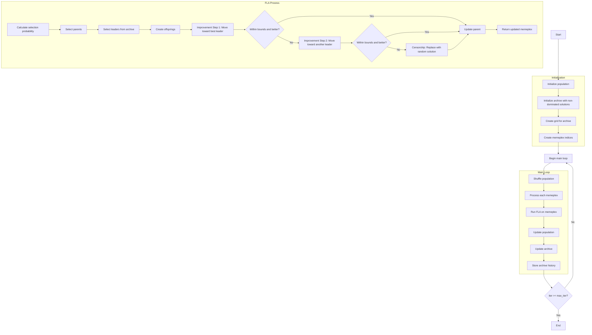

# Algorithm Flowchart for Multi-Objective Shuffled Frog Leaping Optimizer



### Detailed Explanation of Steps:

1. **Initialize population**:
   - Randomly generate initial positions within the search space
   - Each position X_i ∈ [lb, ub]^dim
   - Calculate multi-objective fitness value: multi_fitness = objective_func(X_i)

2. **Initialize archive with non-dominated solutions**:
   - Identify non-dominated solutions in the initial population
   - Add these solutions to the external archive

3. **Create grid for archive**:
   - Create hypercubes grid to manage the archive
   - Assign grid indices to each solution in the archive

4. **Create memeplex indices**:
   - Divide the population into memeplexes
   ```python
   memeplex_indices = np.arange(search_agents_no).reshape(self.n_memeplex, self.memeplex_size)
   ```

5. **Main loop** (max_iter times):
   - **Shuffle population**: Randomly shuffle the population (key step of SFLA)
   
   - **Process each memeplex**: Iterate through each memeplex for optimization
   
   - **Run FLA on memeplex**: Execute Frog Leaping Algorithm on the current memeplex
     * **Calculate selection probability**: Compute selection probability based on diversity grid
     * **Select parents**: Select q parents from memeplex
     * **Select leaders from archive**: Choose leaders from archive using grid-based selection
     * **Create offsprings**: Generate α offsprings from parents
     * **Improvement Step 1**: Move toward the best leader
       ```python
       step = self.fla_sigma * np.random.random(self.dim) * (leaders[0].position - worst_parent.position)
       ```
     * **Improvement Step 2**: Move toward another leader if step 1 fails
     * **Censorship**: Replace with random solution if both steps fail
   
   - **Update population**: Update memeplex with results from FLA
   
   - **Update archive**: Add new non-dominated solutions to the archive
   
   - **Store archive history**: Save current archive state

6. **End**:
   - Save final results
   - Return archive history and final archive

### FLA (Frog Leaping Algorithm) Details:

**FLA Parameters**:
- `fla_q`: Number of parents (default: 30% of memeplex size)
- `fla_alpha`: Number of offsprings (default: 3)
- `fla_beta`: Maximum FLA iterations (default: 5)
- `fla_sigma`: Step size (default: 2.0)

**FLA Process**:
1. Calculate selection probability based on grid diversity
2. Select q parents from memeplex
3. Select 3 leaders from archive (using grid-based selection)
4. Create α offsprings:
   - Find worst parent among selected parents
   - Step 1: Move toward best leader
   - Step 2: Move toward another leader if step 1 fails
   - Censorship: Create random solution if both steps fail
5. Update memeplex with new offsprings