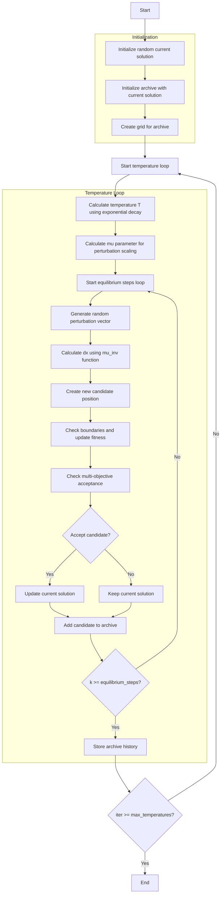

# Multi-Objective Simulated Annealing Optimizer Algorithm Flowchart



### Detailed Step-by-Step Explanation:

1. **Initialize random current solution**:
   - Generate a random position within the search space
   - Calculate objective function values
   ```python
   current_position = np.random.uniform(self.lb, self.ub, self.dim)
   current_fitness = self.objective_func(current_position)
   ```

2. **Initialize archive with current solution**:
   - Add current solution to the archive
   - Archive will be updated with non-dominated solutions

3. **Create grid for archive**:
   - Create hypercube grid to manage the archive
   - Assign grid indices to each solution in the archive

4. **Temperature loop** (max_temperatures iterations):
   - **Calculate temperature T using exponential decay**: Temperature decreases gradually with iteration
     ```python
     T = exponential_decay(initial_temperature, final_value, iter, max_iter)
     ```
   
   - **Calculate mu parameter for perturbation scaling**: Scaling parameter based on temperature
     ```python
     mu = 10 ** (T * self.mu_scaling)
     ```
   
   - **Equilibrium steps loop** (equilibrium_steps iterations):
     * **Generate random perturbation vector**: Random vector in range [-1, 1]
       ```python
       random_vector = 2 * np.random.random(self.dim) - 1
       ```
     * **Calculate dx using mu_inv function**: Calculate displacement based on mu
       ```python
       dx = self._mu_inv(random_vector, mu) * (self.ub - self.lb)
       ```
     * **Create new candidate position**: Generate candidate position from current position + dx
       ```python
       candidate_position = current_solution.position + dx
       ```
     * **Check boundaries and update fitness**: Ensure position is within bounds and calculate fitness
     * **Check multi-objective acceptance**: Decide to accept candidate based on dominance and temperature
       - If candidate dominates current: Always accept
       - If current dominates candidate: Always reject  
       - If non-dominated: Accept with probability based on temperature
       ```python
       accept_prob = np.exp(df / (temperature + np.finfo(float).eps))
       ```
     * **Update current solution**: If candidate is accepted
     * **Add candidate to archive**: Add candidate to archive for consideration
   
   - **Store archive history**: Save archive state after each temperature level

5. **End**:
   - Store final results
   - Return archive history and final archive

### Multi-Objective Acceptance Details:

**Acceptance decision**:
1. **Candidate dominates current**: Always accept
2. **Current dominates candidate**: Always reject
3. **Non-dominated**: Accept with probability
   ```python
   current_avg = np.mean(current.multi_fitness)
   candidate_avg = np.mean(candidate.multi_fitness)
   
   if self.maximize:
       df = candidate_avg - current_avg
   else:
       df = current_avg - candidate_avg
   
   accept_prob = np.exp(df / (temperature + np.finfo(float).eps))
   ```

### Simulated Annealing Parameters:

**Main parameters**:
- `max_temperatures` (100): Maximum number of temperature levels
- `equilibrium_steps` (500): Number of steps at each temperature level
- `initial_temperature` (1): Initial temperature
- `tol_fun` (1e-4): Function tolerance for convergence
- `mu_scaling` (100.0): Scaling parameter for perturbation

**Perturbation functions**:
- `_mu_inv()`: Function to generate perturbation based on temperature
- `exponential_decay()`: Function for exponential temperature decay

**Characteristics of multi-objective SA**:
- Uses Pareto dominance instead of scalar fitness comparison
- Acceptance probability based on temperature and average fitness difference
- Archive maintained to store non-dominated solutions
- Perturbation scale decreases with temperature (from exploration to exploitation)