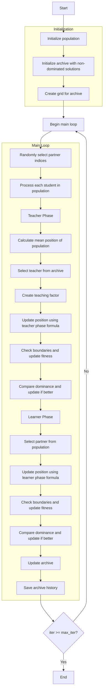

# Multi-Objective Teaching Learning Based Optimizer Algorithm Flowchart



### Detailed Step Explanation:

1. **Initialize population**: 
   - Randomly create initial positions in the search space
   - Each position X_i ∈ [lb, ub]^dim
   - Calculate multi-objective fitness value = objective_func(X_i)

2. **Initialize archive with non-dominated solutions**:
   - Identify non-dominated solutions in the initial population
   - Add these solutions to the external archive

3. **Create grid for archive**:
   - Create hypercube grid to manage the archive
   - Assign grid index to each solution in the archive

4. **Main loop** (max_iter times):
   - **Randomly select partner indices**: Randomly shuffle indices to select partners
     ```python
     partner_indices = np.random.permutation(search_agents_no)
     ```
   
   - **Process each student in population**: Iterate through each student for optimization
   
   - **Teacher Phase**:
     * **Calculate mean position of population**: Compute average position of entire population
       ```python
       mean_position = np.mean([member.position for member in population], axis=0)
       ```
     * **Select teacher from archive**: Choose teacher from archive using grid-based selection
     * **Create teaching factor**: Generate random teaching factor in range (1, 2)
       ```python
       tf = np.random.randint(1, 3)  # 1 or 2
       ```
     * **Update position using teacher phase formula**:
       ```python
       new_position = current_position + r * (teacher_position - tf * mean_position)
       ```
     * **Check boundaries and update fitness**: Ensure position stays within bounds and calculate new fitness
     * **Compare dominance and update if better**: Use Pareto dominance to decide whether to update
   
   - **Learner Phase**:
     * **Select partner from population**: Randomly select partner from population
     * **Update position using learner phase formula**:
       ```python
       if current dominates partner:
           new_position = current_position + r * (current_position - partner_position)
       else:
           new_position = current_position + r * (partner_position - current_position)
       ```
     * **Check boundaries and update fitness**: Ensure position stays within bounds and calculate new fitness
     * **Compare dominance and update if better**: Use Pareto dominance to decide whether to update
   
   - **Update archive**: Add new non-dominated solutions to archive
   
   - **Save archive history**: Save current archive state

5. **End**:
   - Store final results
   - Return archive history and final archive

### TLBO Formulas:

**Teacher Phase**:
```python
r = np.random.random(self.dim)
new_position = current_position + r * (teacher_position - teaching_factor * mean_position)
```

**Learner Phase**:
```python
r = np.random.random(self.dim)
if current dominates partner:
    new_position = current_position + r * (current_position - partner_position)
else:
    new_position = current_position + r * (partner_position - current_position)
```

**TLBO Parameters**:
- `teaching_factor_range`: Range of values for teaching factor (default: (1, 2))
- Teaching factor (TF) is typically 1 or 2, representing the level of teacher influence

**Advantages of Multi-Objective TLBO**:
- No need for complex parameter tuning
- Uses archive and grid-based selection to maintain diversity
- Combines learning from both teacher and peers
- Automatically adjusts based on dominance rather than scalar fitness comparison