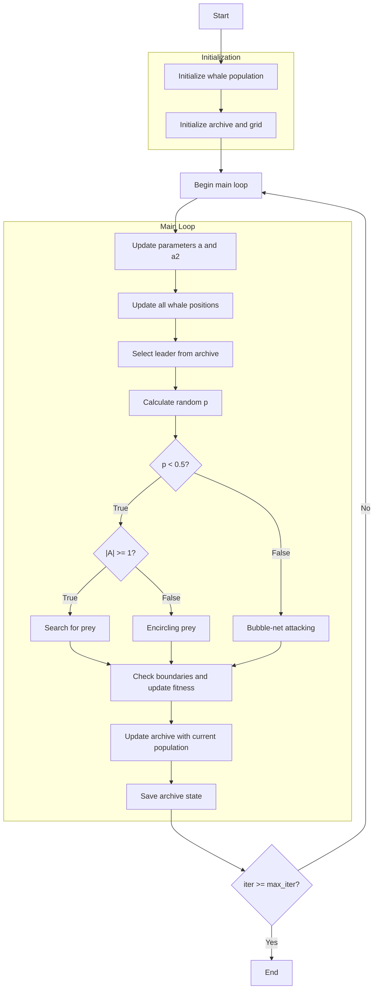

# Multi-Objective Whale Optimization Algorithm Flowchart



### Detailed Explanation of Steps:

1. **Initialize whale population**:
   - Randomly generate initial positions within the search space
   - Each position X_i ∈ [lb, ub]^dim
   - Calculate multi-objective function values

2. **Initialize archive and grid**:
   - Identify non-dominated solutions from the initial population
   - Initialize archive with non-dominated solutions
   - Create grid to manage archive based on objective space

3. **Main loop** (max_iter times):
   - **Update parameters a and a2**:
     * Decrease linearly with iteration count
     ```python
     a = 2 - iter * (2 / max_iter)
     a2 = -1 + iter * ((-1) / max_iter)
     ```

   - **Select leader from archive**:
     * Use grid-based selection to choose leader from archive
     * If archive is empty, randomly select from population

   - **Update all whale positions**:
     * Each whale updates its position based on hunting behavior

   - **Calculate random p**:
     * p ∈ [0, 1] to determine hunting behavior

   - **If p < 0.5 (Encircling or Searching)**:
     * **If |A| >= 1**: Search for prey (exploration)
       * Randomly select leader from archive or population
       ```python
       if self.archive:
           rand_leader = np.random.choice(self.archive)
           D_X_rand = abs(C * rand_leader.position[j] - whale.position[j])
           new_position[j] = rand_leader.position[j] - A * D_X_rand
       ```
     * **If |A| < 1**: Encircling prey (exploitation)
       ```python
       D_leader = abs(C * leader.position[j] - whale.position[j])
       new_position[j] = leader.position[j] - A * D_leader
       ```

   - **If p >= 0.5 (Bubble-net attacking)**:
     * Spiral movement around prey
     ```python
     distance_to_leader = abs(leader.position[j] - whale.position[j])
     new_position[j] = distance_to_leader * np.exp(b * l) * np.cos(l * 2 * np.pi) + leader.position[j]
     ```

   - **Check boundaries and update fitness**:
     * Ensure positions remain within [lb, ub] boundaries
     * Recalculate multi-objective function values

   - **Update archive with current population**:
     * Add non-dominated solutions to archive
     * Maintain archive size by removing redundant solutions
     * Update grid to reflect new archive

   - **Save archive state**:
     * Store current archive for optimization history

4. **End**:
   - Save final results
   - Return archive (set of Pareto optimal solutions) and history