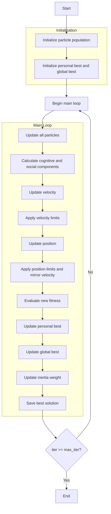

# Particle Swarm Optimizer Algorithm Flowchart



### Detailed Explanation of Steps:

1. **Initialize particle population**:
   - Randomly generate initial positions within the search space
   - Initialize random velocities within allowed limits
   - Each position X_i ∈ [lb, ub]^dim
   - Calculate objective function value objective_func(X_i)

2. **Initialize personal best and global best**:
   - Each particle's personal best is a copy of itself
   - Global best is the particle with the best fitness in the population

3. **Main loop** (max_iter times):
   - **Update all particles**:
     * Each particle updates its position based on velocity

   - **Calculate cognitive and social components**:
     * Cognitive component: direction toward personal best
     * Social component: direction toward global best
     ```python
     cognitive_component = self.c1 * r1 * (personal_best[i].position - population[i].position)
     social_component = self.c2 * r2 * (global_best.position - population[i].position)
     ```

   - **Update velocity**:
     * Combine inertia, cognitive and social components
     ```python
     population[i].velocity = (self.w * population[i].velocity + 
                             cognitive_component + 
                             social_component)
     ```

   - **Apply velocity limits**:
     * Ensure velocity stays within [vel_min, vel_max]

   - **Update position**:
     * Move particle according to velocity
     ```python
     new_position = population[i].position + population[i].velocity
     ```

   - **Apply position limits and mirror velocity**:
     * Ensure position stays within [lb, ub]
     * If boundary exceeded, reverse velocity
     ```python
     outside_bounds = (new_position < self.lb) | (new_position > self.ub)
     population[i].velocity[outside_bounds] = -population[i].velocity[outside_bounds]
     new_position = np.clip(new_position, self.lb, self.ub)
     ```

   - **Evaluate new fitness**:
     * Recalculate objective function value

   - **Update personal best**:
     * If new fitness is better, update personal best

   - **Update global best**:
     * If new personal best is better than global best, update global best

   - **Update inertia weight**:
     * Decrease inertia weight over time to transition from exploration to exploitation
     ```python
     self.w *= self.wdamp
     ```

   - **Save best solution**:
     * Store global best for optimization history

4. **End**:
   - Save final results
   - Display optimization history
   - Return best solution and history