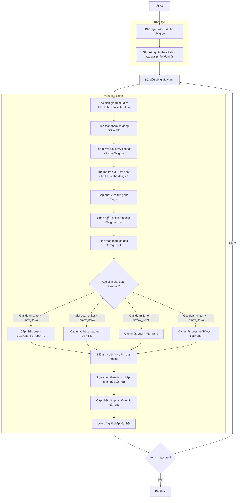

# Sơ đồ thuật toán Prairie Dogs Optimizer



### Giải thích chi tiết các bước:

1. **Khởi tạo quần thể chó đồng cỏ**: 
   - Tạo ngẫu nhiên các vị trí ban đầu trong không gian tìm kiếm
   - Mỗi vị trí X_i ∈ [lb, ub]^dim
   - Tính toán giá trị hàm mục tiêu objective_func(X_i)

2. **Sắp xếp quần thể và khởi tạo giải pháp tốt nhất**:
   - Sắp xếp quần thể dựa trên giá trị fitness
   - Chọn giải pháp tốt nhất ban đầu

3. **Vòng lặp chính** (max_iter lần):
   - **Xác định giá trị mu dựa trên tính chẵn lẻ iteration**:
     ```python
     mu = -1 if (iter + 1) % 2 == 0 else 1
     ```

   - **Tính toán tham số động DS và PE**:
     ```python
     DS = 1.5 * np.random.randn() * (1 - iter/max_iter) ** (2 * iter/max_iter) * mu
     PE = 1.5 * (1 - iter/max_iter) ** (2 * iter/max_iter) * mu
     ```

   - **Tạo bước bay Levy cho tất cả chó đồng cỏ**:
     ```python
     RL = np.array([self._levy_flight() for _ in range(search_agents_no)])
     ```

   - **Tạo ma trận vị trí tốt nhất cho tất cả chó đồng cỏ**:
     ```python
     TPD = np.tile(best_solution.position, (search_agents_no, 1))
     ```

   - **Cập nhật vị trí từng chó đồng cỏ**:
     * **Chọn ngẫu nhiên một chó đồng cỏ khác**:
       ```python
       k = np.random.choice([idx for idx in range(search_agents_no) if idx != i])
       ```
     * **Tính toán tham số đặc trưng PDO**:
       ```python
       cpd = np.random.rand() * (TPD[i, j] - population[k].position[j]) / (TPD[i, j] + self.eps)
       P = self.rho + (population[i].position[j] - np.mean(population[i].position)) / (TPD[i, j] * (self.ub[j] - self.lb[j]) + self.eps)
       eCB = best_solution.position[j] * P
       ```

   - **Chiến lược cập nhật theo giai đoạn**:
     * **Giai đoạn 1 (iter < max_iter/4)**:
       ```python
       new_position[j] = best_solution.position[j] - eCB * self.eps_pd - cpd * RL[i, j]
       ```
     * **Giai đoạn 2 (iter < 2*max_iter/4)**:
       ```python
       new_position[j] = best_solution.position[j] * population[k].position[j] * DS * RL[i, j]
       ```
     * **Giai đoạn 3 (iter < 3*max_iter/4)**:
       ```python
       new_position[j] = best_solution.position[j] * PE * np.random.rand()
       ```
     * **Giai đoạn 4 (iter >= 3*max_iter/4)**:
       ```python
       new_position[j] = best_solution.position[j] - eCB * self.eps - cpd * np.random.rand()
       ```

   - **Kiểm tra biên và đánh giá fitness**:
     * Đảm bảo vị trí nằm trong biên [lb, ub]
     * Tính toán giá trị hàm mục tiêu cho vị trí mới

   - **Lựa chọn tham lam: chấp nhận nếu tốt hơn**:
     * Chỉ chấp nhận vị trí mới nếu nó tốt hơn vị trí hiện tại

   - **Cập nhật giải pháp tốt nhất toàn cục**:
     * So sánh và cập nhật nếu tìm thấy giải pháp tốt hơn

   - **Lưu trữ giải pháp tốt nhất**:
     * Lưu lại giải pháp tốt nhất tại mỗi iteration

4. **Kết thúc**:
   - Lưu trữ kết quả cuối cùng
   - Hiển thị lịch sử tối ưu hóa
   - Trả về giải pháp tốt nhất và lịch sử
