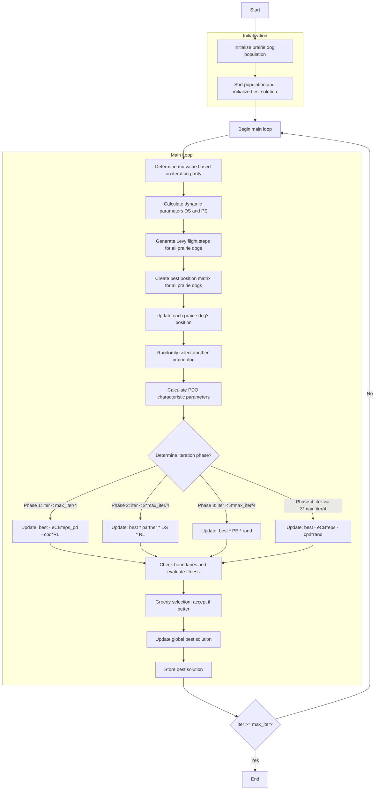

# Prairie Dogs Optimizer Algorithm Flowchart



### Detailed Step-by-Step Explanation:

1. **Initialize prairie dog population**:
   - Randomly generate initial positions within the search space
   - Each position X_i ∈ [lb, ub]^dim
   - Calculate objective function values objective_func(X_i)

2. **Sort population and initialize best solution**:
   - Sort population based on fitness values
   - Select initial best solution

3. **Main loop** (max_iter times):
   - **Determine mu value based on iteration parity**:
     ```python
     mu = -1 if (iter + 1) % 2 == 0 else 1
     ```

   - **Calculate dynamic parameters DS and PE**:
     ```python
     DS = 1.5 * np.random.randn() * (1 - iter/max_iter) ** (2 * iter/max_iter) * mu
     PE = 1.5 * (1 - iter/max_iter) ** (2 * iter/max_iter) * mu
     ```

   - **Generate Levy flight steps for all prairie dogs**:
     ```python
     RL = np.array([self._levy_flight() for _ in range(search_agents_no)])
     ```

   - **Create best position matrix for all prairie dogs**:
     ```python
     TPD = np.tile(best_solution.position, (search_agents_no, 1))
     ```

   - **Update each prairie dog's position**:
     * **Randomly select another prairie dog**:
       ```python
       k = np.random.choice([idx for idx in range(search_agents_no) if idx != i])
       ```
     * **Calculate PDO characteristic parameters**:
       ```python
       cpd = np.random.rand() * (TPD[i, j] - population[k].position[j]) / (TPD[i, j] + self.eps)
       P = self.rho + (population[i].position[j] - np.mean(population[i].position)) / (TPD[i, j] * (self.ub[j] - self.lb[j]) + self.eps)
       eCB = best_solution.position[j] * P
       ```

   - **Update strategy by phase**:
     * **Phase 1 (iter < max_iter/4)**:
       ```python
       new_position[j] = best_solution.position[j] - eCB * self.eps_pd - cpd * RL[i, j]
       ```
     * **Phase 2 (iter < 2*max_iter/4)**:
       ```python
       new_position[j] = best_solution.position[j] * population[k].position[j] * DS * RL[i, j]
       ```
     * **Phase 3 (iter < 3*max_iter/4)**:
       ```python
       new_position[j] = best_solution.position[j] * PE * np.random.rand()
       ```
     * **Phase 4 (iter >= 3*max_iter/4)**:
       ```python
       new_position[j] = best_solution.position[j] - eCB * self.eps - cpd * np.random.rand()
       ```

   - **Check boundaries and evaluate fitness**:
     * Ensure positions remain within bounds [lb, ub]
     * Calculate objective function values for new positions

   - **Greedy selection: accept if better**:
     * Only accept new positions if they are better than current positions

   - **Update global best solution**:
     * Compare and update if better solutions are found

   - **Store best solution**:
     * Save the best solution at each iteration

4. **End**:
   - Store final results
   - Display optimization history
   - Return best solution and history