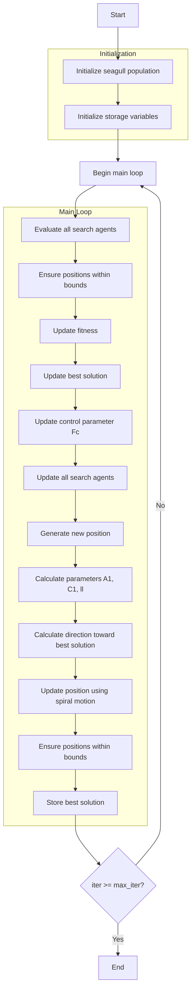

# Seagull Optimizer Algorithm Flowchart



### Detailed Step-by-Step Explanation:

1. **Initialize seagull population**:
   - Randomly generate initial positions for seagulls
   - Each seagull represents a solution in the search space

2. **Initialize storage variables**:
   - Initialize optimization history
   - Initialize initial best solution

3. **Main loop** (max_iter times):
   - **Evaluate all search agents**:
     * Process each seagull in the population
   
   - **Ensure positions within bounds**:
     * Keep seagull positions within [lb, ub] range
     ```python
     population[i].position = np.clip(population[i].position, self.lb, self.ub)
     ```
   
   - **Update fitness**:
     * Calculate objective function value for each seagull
   
   - **Update best solution**:
     * Compare and update if a better solution is found
   
   - **Update control parameter Fc**:
     * Linearly decrease from 2 to 0 over iterations
     * Controls balance between exploration and exploitation
     ```python
     Fc = 2 - iter * (2 / max_iter)
     ```
   
   - **Update all search agents**:
     * Update position of each seagull
   
   - **Generate new position**:
     * Initialize new position for each dimension
   
   - **Calculate parameters A1, C1, ll**:
     * A1: Parameter controlling movement direction
     * C1: Random parameter
     * ll: Parameter for spiral motion
     ```python
     A1 = 2 * Fc * r1 - Fc
     C1 = 2 * r2
     ll = (Fc - 1) * np.random.random() + 1
     ```
   
   - **Calculate direction toward best solution**:
     * Calculate movement direction toward the best solution
     ```python
     D_alphs = Fc * member.position[j] + A1 * (best_solver.position[j] - member.position[j])
     ```
   
   - **Update position using spiral motion**:
     * Simulate seagull attack behavior
     * Use exponential and cosine functions to create spiral motion
     ```python
     X1 = D_alphs * np.exp(ll) * np.cos(ll * 2 * np.pi) + best_solver.position[j]
     new_position[j] = X1
     ```
   
   - **Ensure positions within bounds**:
     * Keep new positions within allowed range
   
   - **Store best solution**:
     * Save the best solution at each iteration

4. **End**:
   - Store final results
   - Display optimization history
   - Return the best solution