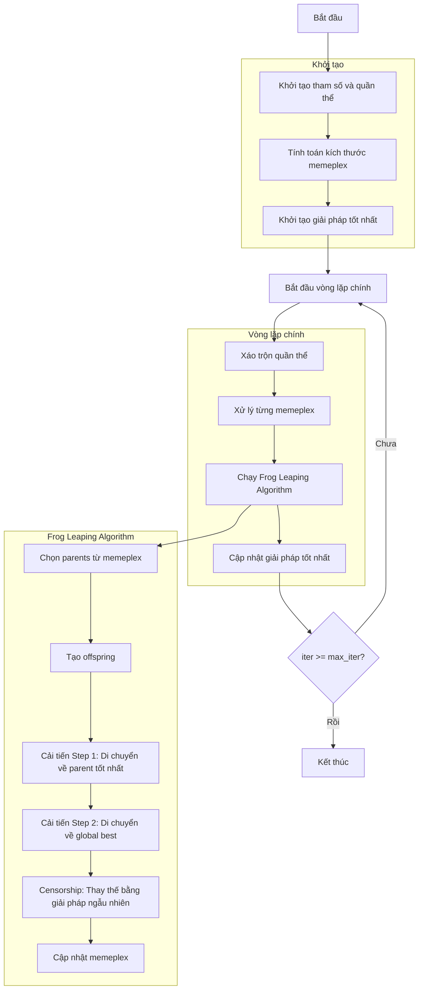

# Sơ đồ thuật toán Shuffled Frog Leaping Optimizer



## Giải thích chi tiết các bước:

### 1. Khởi tạo tham số và quần thể
- Thiết lập các tham số SFLA: số memeplex, kích thước memeplex, tham số FLA
- Tạo quần thể ban đầu ngẫu nhiên trong không gian tìm kiếm
- Mỗi cá thể (ếch) có vị trí và giá trị fitness

```python
# Khởi tạo quần thể
population = []
for _ in range(search_agents_no):
    position = np.random.uniform(self.lb, self.ub, self.dim)
    fitness = self.objective_func(position)
    population.append(Member(position, fitness))
```

### 2. Tính toán kích thước memeplex
- Đảm bảo kích thước memeplex phù hợp với số chiều bài toán
- Điều chỉnh kích thước quần thể để phù hợp với cấu trúc memeplex

```python
# Đảm bảo memeplex size >= dimension + 1
self.memeplex_size = max(self.memeplex_size, self.dim + 1)
total_pop_size = self.n_memeplex * self.memeplex_size
```

### 3. Khởi tạo giải pháp tốt nhất
- Sắp xếp quần thể và chọn giải pháp tốt nhất ban đầu
- Khởi tạo lịch sử tối ưu hóa

```python
sorted_population, _ = self._sort_population(population)
best_solution = sorted_population[0].copy()
history_step_solver = []
```

### 4. Xáo trộn quần thể (Shuffling)
- Trộn ngẫu nhiên quần thể để tạo sự đa dạng
- Chia quần thể thành các memeplex

```python
np.random.shuffle(population)
memeplex_indices = np.arange(search_agents_no).reshape(self.n_memeplex, self.memeplex_size)
```

### 5. Xử lý từng memeplex bằng Frog Leaping Algorithm (FLA)
Mỗi memeplex được xử lý độc lập:

#### a. Chọn parents từ memeplex
- Sử dụng xác suất chọn lọc dựa trên rank
- Chọn q parents tốt nhất

```python
ranks = np.arange(n_pop, 0, -1)
selection_probs = 2 * (n_pop + 1 - ranks) / (n_pop * (n_pop + 1))
parent_indices = self._rand_sample(selection_probs, self.fla_q)
```

#### b. Tạo offspring và cải tiến
**Cải tiến Step 1**: Di chuyển về parent tốt nhất
```python
step = self.fla_sigma * np.random.random(self.dim) * (best_parent.position - worst_parent.position)
new_position = worst_parent.position + step
```

**Cải tiến Step 2**: Di chuyển về global best
```python
step = self.fla_sigma * np.random.random(self.dim) * (best_solution.position - worst_parent.position)
new_position = worst_parent.position + step
```

#### c. Censorship
Nếu cả hai bước cải tiến thất bại, thay thế bằng giải pháp ngẫu nhiên:
```python
random_position = np.random.uniform(lower_bound, upper_bound, self.dim)
random_fitness = self.objective_func(random_position)
```

### 6. Cập nhật giải pháp tốt nhất
- Sau mỗi iteration, sắp xếp lại toàn bộ quần thể
- So sánh và cập nhật giải pháp tốt nhất toàn cục

```python
sorted_population, _ = self._sort_population(population)
current_best = sorted_population[0]
if self._is_better(current_best, best_solution):
    best_solution = current_best.copy()
```

### 7. Kết thúc
- Lưu trữ kết quả cuối cùng
- Hiển thị lịch sử tối ưu hóa
- Trả về giải pháp tốt nhất và lịch sử

```python
self.history_step_solver = history_step_solver
self.best_solver = best_solution
return history_step_solver, best_solution
```

## Đặc điểm thuật toán SFLA:
- **Memetic algorithm**: Kết hợp tìm kiếm toàn cục và cục bộ
- **Parallel search**: Các memeplex hoạt động song song
- **Shuffling mechanism**: Đảm bảo trao đổi thông tin giữa các memeplex
- **Adaptive search**: FLA điều chỉnh hướng tìm kiếm dựa trên chất lượng solution

Thuật toán này đặc biệt hiệu quả cho các bài toán tối ưu hóa đa modal và có khả năng tránh được cực trị địa phương tốt nhờ cơ chế shuffling và memeplex.
