# Shuffled Frog Leaping Optimizer Algorithm Flowchart

```mermaid
flowchart TD
    A["Start"] --> B["Initialize SFLA Parameters"]
    B --> C["Adjust Population Size for Memeplex"]
    C --> D["Initialize Frog Population"]
    D --> E["Sort Population and Initialize Best Solution"]
    E --> F["Create Memeplex Indices"]
    F --> G["Begin Main Loop"]
    G --> H["Prepare FLA Parameters"]
    H --> I["Shuffle Population"]
    I --> J["Process Each Memeplex"]
    J --> K["Extract Memeplex"]
    K --> L["Run Frog Leaping Algorithm on Memeplex"]
    L --> M["Calculate Selection Probability"]
    M --> N["Select Parents"]
    N --> O["Generate Offspring"]
    O --> P["Sort Parents from Best to Worst"]
    P --> Q["Improvement Step 1: Move Towards Best Parent"]
    Q --> R{"New Position Within Bounds and Better?"}
    R -- "Yes" --> S["Update Memeplex"]
    R -- "No" --> T["Require Improvement Step 2"]
    T --> U["Improvement Step 2: Move Towards Global Best Solution"]
    U --> V{"New Position Within Bounds and Better?"}
    V -- "Yes" --> S
    V -- "No" --> W["Require Censorship"]
    W --> X["Censorship: Replace with Random Solution"]
    X --> S
    S --> Y["Update Population"]
    Y --> Z["Sort Population and Update Best Solution"]
    Z --> AA["Store Best Solution"]
    AA --> AB{"iter >= max_iter?"}
    AB -- "No" --> G
    AB -- "Yes" --> AC["End"]
    
    subgraph Initialization
    B
    C
    D
    E
    F
    end
    
    subgraph Main Loop
    H
    I
    J
    K
    L
    M
    N
    O
    P
    Q
    R
    S
    T
    U
    V
    W
    X
    Y
    Z
    AA
    end
```



### Detailed Step-by-Step Explanation:

1. **Initialize SFLA Parameters**:
   - Set default parameters for the algorithm
   - n_memeplex: Number of memeplexes
   - memeplex_size: Size of each memeplex
   - fla_q: Number of parents in FLA
   - fla_alpha: Number of offspring
   - fla_beta: Maximum iterations in FLA
   - fla_sigma: Step size for movement

2. **Adjust Population Size for Memeplex**:
   ```python
   total_pop_size = self.n_memeplex * self.memeplex_size
   ```

3. **Initialize Frog Population**:
   - Randomly generate initial positions within the search space
   - Each position X_i ∈ [lb, ub]^dim
   - Calculate objective function value objective_func(X_i)

4. **Sort Population and Initialize Best Solution**:
   - Sort population based on fitness values
   - Select initial best solution

5. **Create Memeplex Indices**:
   ```python
   memeplex_indices = np.arange(search_agents_no).reshape(self.n_memeplex, self.memeplex_size)
   ```

6. **Main Loop** (max_iter times):
   - **Shuffle Population**:
     * Randomly shuffle population to create new memeplexes

   - **Process Each Memeplex**:
     * Each memeplex is processed independently using Frog Leaping Algorithm

   - **Run Frog Leaping Algorithm on Memeplex**:
     * **Calculate Selection Probability**:
       ```python
       selection_probs = 2 * (n_pop + 1 - ranks) / (n_pop * (n_pop + 1))
       ```
     * **Select Parents**:
       * Select q parents based on selection probability

     * **Generate Offspring**:
       * Generate alpha offspring from selected parents

     * **Improvement Step 1: Move Towards Best Parent**:
       ```python
       step = self.fla_sigma * np.random.random(self.dim) * (sorted_parents[0].position - worst_parent.position)
       new_sol_1.position = worst_parent.position + step
       ```

     * **Improvement Step 2: Move Towards Global Best Solution**:
       ```python
       step = self.fla_sigma * np.random.random(self.dim) * (best_solution.position - worst_parent.position)
       new_sol_2.position = worst_parent.position + step
       ```

     * **Censorship: Replace with Random Solution**:
       * If both improvement steps fail, replace with random solution within memeplex range

   - **Update Population**:
     * Update memeplex with new solutions

   - **Sort Population and Update Best Solution**:
     * Compare and update if better solution is found

   - **Store Best Solution**:
     * Save the best solution at each iteration

7. **End**:
   - Store final results
   - Display optimization history
   - Return best solution and history