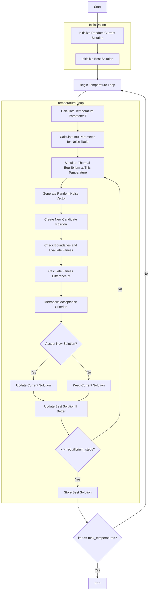

# Simulated Annealing Optimizer Algorithm Flowchart



### Detailed Step-by-Step Explanation:

1. **Initialize Random Current Solution**:
   - Generate a random initial position within the search space
   - Position X ∈ [lb, ub]^dim
   - Calculate objective function value objective_func(X)

2. **Initialize Best Solution**:
   - Initialize the initial best solution from the current solution

3. **Temperature Loop** (max_temperatures iterations):
   - **Calculate Temperature Parameter T**:
     ```python
     T = iter / actual_max_iter  # From 0 to 1
     ```

   - **Calculate mu Parameter for Noise Ratio**:
     ```python
     mu = 10 ** (T * self.mu_scaling)
     ```

   - **Simulate Thermal Equilibrium at This Temperature** (equilibrium_steps iterations):
     * **Generate Random Noise Vector**:
       ```python
       random_vector = 2 * np.random.random(self.dim) - 1  # [-1, 1]
       dx = self._mu_inv(random_vector, mu) * (self.ub - self.lb)
       ```

     * **Create New Candidate Position**:
       ```python
       candidate_position = current_solution.position + dx
       ```

     * **Check Boundaries and Evaluate Fitness**:
       * Ensure position stays within bounds [lb, ub]
       * Calculate objective function value for the new position

     * **Calculate Fitness Difference df**:
       ```python
       df = candidate_fitness - current_solution.fitness
       ```

     * **Metropolis Acceptance Criterion**:
       * **For Maximization**:
         ```python
         accept = (df > 0) or (np.random.random() > 
                 np.exp(T * df / (abs(current_solution.fitness) + np.finfo(float).eps) / self.tol_fun))
         ```
       * **For Minimization**:
         ```python
         accept = (df < 0) or (np.random.random() < 
                 np.exp(-T * df / (abs(current_solution.fitness) + np.finfo(float).eps) / self.tol_fun))
         ```

     * **Update Current Solution**:
       * Accept new solution if it meets Metropolis criterion

     * **Update Best Solution**:
       * Compare and update if a better solution is found

   - **Store Best Solution**:
     * Save the best solution at each temperature level

4. **End**:
   - Store final results
   - Display optimization history
   - Return best solution and history

### mu_inv Function:
```python
def _mu_inv(self, y: np.ndarray, mu: float) -> np.ndarray:
    """
    Generate noise vector proportional to current temperature level.
    
    Formula:
    mu_inv(y) = (((1 + mu) ** |y| - 1) / mu) * sign(y)
    """
    return (((1 + mu) ** np.abs(y) - 1) / mu) * np.sign(y)
```