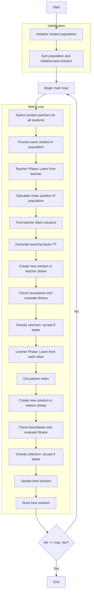

# Teaching Learning Based Optimizer Algorithm Flowchart



### Detailed Explanation of Steps:

1. **Initialize student population**:
   - Randomly generate initial positions within the search space
   - Each position X_i ∈ [lb, ub]^dim
   - Calculate objective function value objective_func(X_i)

2. **Sort population and initialize best solution**:
   - Sort population based on fitness values
   - Select initial best solution

3. **Main loop** (max_iter times):
   - **Select random partners for all students**:
     ```python
     partner_indices = np.random.permutation(search_agents_no)
     ```

   - **Process each student in population**:
     * Each student goes through two phases: Teacher and Learner

   - **Teacher Phase: Learn from teacher**:
     * **Calculate mean position of population**:
       ```python
       mean_position = self._calculate_mean_position(population)
       ```
     * **Find teacher (best solution)**:
       ```python
       teacher = self._find_teacher(population)
       ```
     * **Generate teaching factor TF**:
       ```python
       tf = self._generate_teaching_factor()
       ```
     * **Create new solution in teacher phase**:
       ```python
       new_position_teacher = current_position + r * (teacher_position - teaching_factor * mean_position)
       ```

   - **Check boundaries and evaluate fitness**:
     * Ensure position stays within bounds [lb, ub]
     * Calculate objective function value for new position

   - **Greedy selection: accept if better**:
     * Only accept new position if it's better than current position

   - **Learner Phase: Learn from each other**:
     * **Get partner index**:
       ```python
       partner_idx = partner_indices[i]
       ```
     * **Create new solution in learner phase**:
       * **If current student is better than partner**:
         ```python
         new_position_learner = current_position + r * (current_position - partner_position)
         ```
       * **If current student is worse than partner**:
         ```python
         new_position_learner = current_position + r * (partner_position - current_position)
         ```

   - **Update best solution**:
     * Compare and update if better solution is found

   - **Store best solution**:
     * Save best solution at each iteration

4. **End**:
   - Store final results
   - Display optimization history
   - Return best solution and history