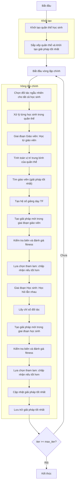

# Sơ đồ thuật toán Teaching Learning Based Optimizer



### Giải thích chi tiết các bước:

1. **Khởi tạo quần thể học sinh**: 
   - Tạo ngẫu nhiên các vị trí ban đầu trong không gian tìm kiếm
   - Mỗi vị trí X_i ∈ [lb, ub]^dim
   - Tính toán giá trị hàm mục tiêu objective_func(X_i)

2. **Sắp xếp quần thể và khởi tạo giải pháp tốt nhất**:
   - Sắp xếp quần thể dựa trên giá trị fitness
   - Chọn giải pháp tốt nhất ban đầu

3. **Vòng lặp chính** (max_iter lần):
   - **Chọn đối tác ngẫu nhiên cho tất cả học sinh**:
     ```python
     partner_indices = np.random.permutation(search_agents_no)
     ```

   - **Xử lý từng học sinh trong quần thể**:
     * Mỗi học sinh trải qua hai giai đoạn: Giáo viên và Học sinh

   - **Giai đoạn Giáo viên: Học từ giáo viên**:
     * **Tính toán vị trí trung bình của quần thể**:
       ```python
       mean_position = self._calculate_mean_position(population)
       ```
     * **Tìm giáo viên (giải pháp tốt nhất)**:
       ```python
       teacher = self._find_teacher(population)
       ```
     * **Tạo hệ số giảng dạy TF**:
       ```python
       tf = self._generate_teaching_factor()
       ```
     * **Tạo giải pháp mới trong giai đoạn giáo viên**:
       ```python
       new_position_teacher = current_position + r * (teacher_position - teaching_factor * mean_position)
       ```

   - **Kiểm tra biên và đánh giá fitness**:
     * Đảm bảo vị trí nằm trong biên [lb, ub]
     * Tính toán giá trị hàm mục tiêu cho vị trí mới

   - **Lựa chọn tham lam: chấp nhận nếu tốt hơn**:
     * Chỉ chấp nhận vị trí mới nếu nó tốt hơn vị trí hiện tại

   - **Giai đoạn Học sinh: Học hỏi lẫn nhau**:
     * **Lấy chỉ số đối tác**:
       ```python
       partner_idx = partner_indices[i]
       ```
     * **Tạo giải pháp mới trong giai đoạn học sinh**:
       * **Nếu học sinh hiện tại tốt hơn đối tác**:
         ```python
         new_position_learner = current_position + r * (current_position - partner_position)
         ```
       * **Nếu học sinh hiện tại kém hơn đối tác**:
         ```python
         new_position_learner = current_position + r * (partner_position - current_position)
         ```

   - **Cập nhật giải pháp tốt nhất**:
     * So sánh và cập nhật nếu tìm thấy giải pháp tốt hơn

   - **Lưu trữ giải pháp tốt nhất**:
     * Lưu lại giải pháp tốt nhất tại mỗi iteration

4. **Kết thúc**:
   - Lưu trữ kết quả cuối cùng
   - Hiển thị lịch sử tối ưu hóa
   - Trả về giải pháp tốt nhất và lịch sử
