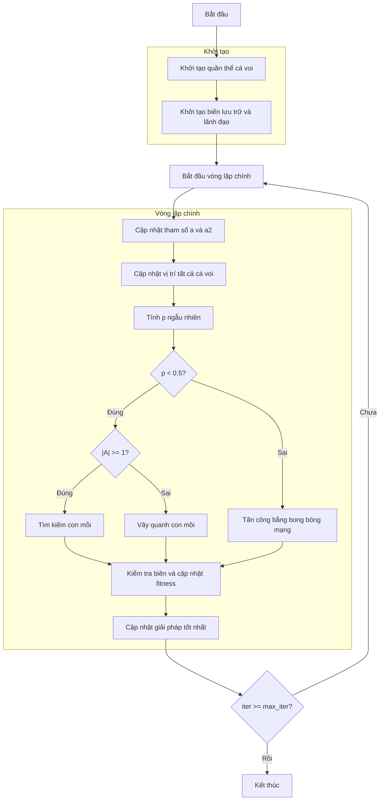

# Sơ đồ thuật toán Whale Optimizer



### Giải thích chi tiết các bước:

1. **Khởi tạo quần thể cá voi**: 
   - Tạo ngẫu nhiên các vị trí ban đầu trong không gian tìm kiếm
   - Mỗi vị trí X_i ∈ [lb, ub]^dim
   - Tính toán giá trị hàm mục tiêu objective_func(X_i)

2. **Khởi tạo biến lưu trữ và lãnh đạo**:
   - Khởi tạo lịch sử tối ưu hóa
   - Khởi tạo giải pháp tốt nhất ban đầu
   - Chọn lãnh đạo từ quần thể dựa trên fitness

3. **Vòng lặp chính** (max_iter lần):
   - **Cập nhật tham số a và a2**: 
     * Giảm tuyến tính theo số lần lặp
     ```python
     a = 2 - iter * (2 / max_iter)
     a2 = -1 + iter * ((-1) / max_iter)
     ```

   - **Cập nhật vị trí tất cả cá voi**:
     * Mỗi cá voi cập nhật vị trí dựa trên hành vi săn mồi

   - **Tính p ngẫu nhiên**: 
     * p ∈ [0, 1] để quyết định hành vi săn mồi

   - **Nếu p < 0.5 (Vây quanh hoặc Tìm kiếm)**:
     * **Nếu |A| >= 1**: Tìm kiếm con mồi (khám phá)
       ```python
       rand_leader_index = np.random.randint(0, search_agents_no)
       X_rand = population[rand_leader_index].position
       D_X_rand = abs(C * X_rand[j] - member.position[j])
       new_position[j] = X_rand[j] - A * D_X_rand
       ```
     * **Nếu |A| < 1**: Vây quanh con mồi (khai thác)
       ```python
       D_leader = abs(C * leader.position[j] - member.position[j])
       new_position[j] = leader.position[j] - A * D_leader
       ```

   - **Nếu p >= 0.5 (Tấn công bằng bong bóng mạng)**:
     * Di chuyển xoắn ốc quanh con mồi
     ```python
     distance_to_leader = abs(leader.position[j] - member.position[j])
     new_position[j] = distance_to_leader * np.exp(b * l) * np.cos(l * 2 * np.pi) + leader.position[j]
     ```

   - **Kiểm tra biên và cập nhật fitness**:
     * Đảm bảo vị trí nằm trong biên [lb, ub]
     * Tính toán lại giá trị hàm mục tiêu

   - **Cập nhật giải pháp tốt nhất**:
     * So sánh và cập nhật nếu tìm thấy giải pháp tốt hơn

4. **Kết thúc**:
   - Lưu trữ kết quả cuối cùng
   - Hiển thị lịch sử tối ưu hóa
   - Trả về giải pháp tốt nhất và lịch sử
