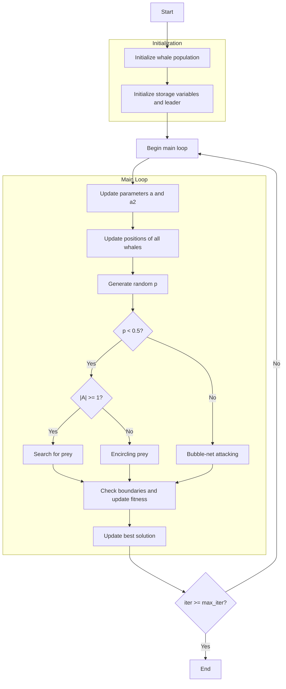

# Whale Optimization Algorithm Flowchart



### Detailed Step-by-Step Explanation:

1. **Initialize whale population**:
   - Randomly generate initial positions within the search space
   - Each position X_i ∈ [lb, ub]^dim
   - Calculate objective function values objective_func(X_i)

2. **Initialize storage variables and leader**:
   - Initialize optimization history
   - Initialize the best solution
   - Select leader from population based on fitness

3. **Main loop** (max_iter times):
   - **Update parameters a and a2**:
     * Decrease linearly with iteration count
     ```python
     a = 2 - iter * (2 / max_iter)
     a2 = -1 + iter * ((-1) / max_iter)
     ```

   - **Update positions of all whales**:
     * Each whale updates its position based on hunting behavior

   - **Generate random p**:
     * p ∈ [0, 1] to determine hunting behavior

   - **If p < 0.5 (Encircling or Searching)**:
     * **If |A| >= 1**: Search for prey (exploration)
       ```python
       rand_leader_index = np.random.randint(0, search_agents_no)
       X_rand = population[rand_leader_index].position
       D_X_rand = abs(C * X_rand[j] - member.position[j])
       new_position[j] = X_rand[j] - A * D_X_rand
       ```
     * **If |A| < 1**: Encircling prey (exploitation)
       ```python
       D_leader = abs(C * leader.position[j] - member.position[j])
       new_position[j] = leader.position[j] - A * D_leader
       ```

   - **If p >= 0.5 (Bubble-net attacking)**:
     * Spiral movement around prey
     ```python
     distance_to_leader = abs(leader.position[j] - member.position[j])
     new_position[j] = distance_to_leader * np.exp(b * l) * np.cos(l * 2 * np.pi) + leader.position[j]
     ```

   - **Check boundaries and update fitness**:
     * Ensure positions remain within bounds [lb, ub]
     * Recalculate objective function values

   - **Update best solution**:
     * Compare and update if better solutions are found

4. **End**:
   - Store final results
   - Display optimization history
   - Return best solution and history