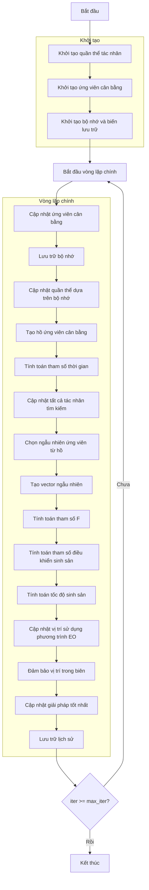

# Sơ đồ thuật toán Equilibrium Optimizer



### Giải thích chi tiết các bước:

1. **Khởi tạo quần thể tác nhân**:
   - Tạo ngẫu nhiên các vị trí ban đầu cho tác nhân tìm kiếm
   - Mỗi tác nhân đại diện cho một giải pháp trong không gian tìm kiếm

2. **Khởi tạo ứng viên cân bằng**:
   - Khởi tạo 4 ứng viên cân bằng (Ceq1, Ceq2, Ceq3, Ceq4)
   - Khởi tạo giá trị fitness ban đầu cho các ứng viên
   ```python
   Ceq1 = Member(np.zeros(self.dim), np.inf if not self.maximize else -np.inf)
   Ceq2 = Member(np.zeros(self.dim), np.inf if not self.maximize else -np.inf)
   Ceq3 = Member(np.zeros(self.dim), np.inf if not self.maximize else -np.inf)
   Ceq4 = Member(np.zeros(self.dim), np.inf if not self.maximize else -np.inf)
   ```

3. **Khởi tạo bộ nhớ và biến lưu trữ**:
   - Khởi tạo bộ nhớ cho quần thể cũ và fitness
   - Khởi tạo lịch sử tối ưu hóa
   ```python
   C_old = [member.copy() for member in population]
   fit_old = np.array([member.fitness for member in population])
   ```

4. **Vòng lặp chính** (max_iter lần):
   - **Cập nhật ứng viên cân bằng**:
     * Đảm bảo vị trí trong biên
     * Tính toán fitness mới
     * Cập nhật 4 ứng viên cân bằng dựa trên thứ hạng fitness
     * Ứng viên tốt nhất được lưu vào Ceq1, tiếp theo là Ceq2, Ceq3, Ceq4
   
   - **Lưu trữ bộ nhớ**:
     * Lưu trữ trạng thái quần thể hiện tại vào bộ nhớ
   
   - **Cập nhật quần thể dựa trên bộ nhớ**:
     * So sánh fitness hiện tại với fitness trong bộ nhớ
     * Khôi phục vị trí và fitness từ bộ nhớ nếu tốt hơn
   
   - **Tạo hồ ứng viên cân bằng**:
     * Tính toán ứng viên cân bằng trung bình (Ceq_ave)
     * Tạo hồ gồm 5 ứng viên: Ceq1, Ceq2, Ceq3, Ceq4, Ceq_ave
     ```python
     Ceq_ave = Member((Ceq1.position + Ceq2.position + Ceq3.position + Ceq4.position) / 4, 0)
     Ceq_pool = [Ceq1, Ceq2, Ceq3, Ceq4, Ceq_ave]
     ```
   
   - **Tính toán tham số thời gian**:
     * Tính tham số thời gian giảm dần theo số lần lặp
     ```python
     t = (1 - iter / max_iter) ** (self.a2 * iter / max_iter)
     ```
   
   - **Cập nhật tất cả tác nhân tìm kiếm**:
     * Xử lý từng tác nhân trong quần thể
   
   - **Chọn ngẫu nhiên ứng viên từ hồ**:
     * Chọn ngẫu nhiên một ứng viên từ hồ 5 ứng viên
     ```python
     Ceq = np.random.choice(Ceq_pool)
     ```
   
   - **Tạo vector ngẫu nhiên**:
     * Tạo vector lambda và r ngẫu nhiên
     ```python
     lambda_vec = np.random.random(self.dim)
     r = np.random.random(self.dim)
     ```
   
   - **Tính toán tham số F**:
     * Tính tham số F dựa trên công thức vật lý
     ```python
     F = self.a1 * np.sign(r - 0.5) * (np.exp(-lambda_vec * t) - 1)
     ```
   
   - **Tính toán tham số điều khiển sinh sản**:
     * Tính toán tham số điều khiển quá trình sinh sản
     ```python
     GCP = 0.5 * r1 * np.ones(self.dim) * (r2 >= self.GP)
     ```
   
   - **Tính toán tốc độ sinh sản**:
     * Tính toán tốc độ sinh sản G0 và G
     ```python
     G0 = GCP * (Ceq.position - lambda_vec * population[i].position)
     G = G0 * F
     ```
   
   - **Cập nhật vị trí sử dụng phương trình EO**:
     * Cập nhật vị trí dựa trên phương trình cân bằng
     ```python
     new_position = Ceq.position + (population[i].position - Ceq.position) * F + (G / (lambda_vec * 1.0)) * (1 - F)
     ```
   
   - **Đảm bảo vị trí trong biên**:
     * Giữ các vị trí trong phạm vi [lb, ub]
   
   - **Cập nhật giải pháp tốt nhất**:
     * So sánh và cập nhật nếu tìm thấy giải pháp tốt hơn
   
   - **Lưu trữ lịch sử**:
     * Lưu lại giải pháp tốt nhất tại mỗi lần lặp

5. **Kết thúc**:
   - Lưu trữ kết quả cuối cùng
   - Hiển thị lịch sử tối ưu hóa
   - Trả về giải pháp tốt nhất
