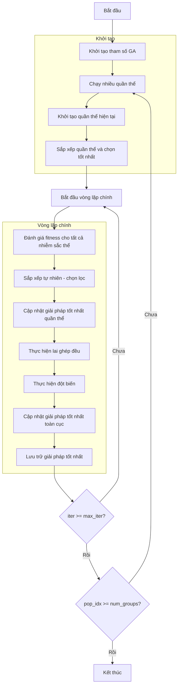

# Sơ đồ thuật toán Genetic Algorithm Optimizer



### Giải thích chi tiết các bước:

1. **Khởi tạo tham số GA**:
   - Thiết lập các tham số thuật toán di truyền
   - Số lượng nhóm quần thể (num_groups)
   - Tỷ lệ lai ghép (crossover_rate)
   - Tỷ lệ đột biến (mutation_rate)

2. **Chạy nhiều quần thể**:
   - Chạy song song nhiều quần thể độc lập
   - Mỗi quần thể có số lượng nhiễm sắc thể riêng

3. **Khởi tạo quần thể hiện tại**:
   - Tạo ngẫu nhiên các nhiễm sắc thể ban đầu
   ```python
   population = self._init_population(search_agents_no)
   ```

4. **Sắp xếp quần thể và chọn tốt nhất**:
   - Sắp xếp nhiễm sắc thể theo độ thích nghi
   - Chọn giải pháp tốt nhất ban đầu cho quần thể

5. **Vòng lặp chính** (max_iter lần):
   - **Đánh giá fitness cho tất cả nhiễm sắc thể**:
     * Tính toán giá trị hàm mục tiêu cho mỗi nhiễm sắc thể
   
   - **Sắp xếp tự nhiên - chọn lọc**:
     * Sắp xếp quần thể theo độ thích nghi
     * Chọn ra các nhiễm sắc thể tốt nhất
   
   - **Cập nhật giải pháp tốt nhất quần thể**:
     * So sánh và cập nhật nếu tìm thấy giải pháp tốt hơn
   
   - **Thực hiện lai ghép đều**:
     * Lai ghép giữa các nhiễm sắc thể với xác suất crossover_rate
     * Bảo tồn 2 nhiễm sắc thể tốt nhất (elitism)
     ```python
     if np.random.random() < self.crossover_rate:
         # Uniform crossover logic
     ```
   
   - **Thực hiện đột biến**:
     * Đột biến nhiễm sắc thể xấu nhất với xác suất mutation_rate
     * Thay thế bằng giải pháp ngẫu nhiên mới
     ```python
     if np.random.random() < self.mutation_rate:
         new_population[worst_idx].position = np.random.uniform(self.lb, self.ub, self.dim)
     ```
   
   - **Cập nhật giải pháp tốt nhất toàn cục**:
     * So sánh giữa các quần thể để tìm giải pháp tốt nhất
   
   - **Lưu trữ giải pháp tốt nhất**:
     * Lưu lại lịch sử tối ưu hóa

6. **Kết thúc**:
   - Lưu trữ kết quả cuối cùng
   - Hiển thị lịch sử tối ưu hóa
   - Trả về giải pháp tốt nhất
