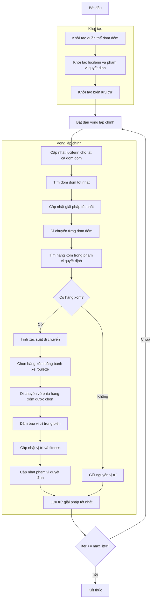

# Sơ đồ thuật toán Glowworm Swarm Optimizer



### Giải thích chi tiết các bước:

1. **Khởi tạo quần thể đom đóm**:
   - Tạo ngẫu nhiên các vị trí ban đầu cho đom đóm
   - Mỗi đom đóm đại diện cho một giải pháp trong không gian tìm kiếm

2. **Khởi tạo luciferin và phạm vi quyết định**:
   - Khởi tạo giá trị luciferin ban đầu cho tất cả đom đóm
   - Khởi tạo phạm vi quyết định ban đầu
   ```python
   self.luciferin = np.full(search_agents_no, self.L0)
   self.decision_range = np.full(search_agents_no, self.r0)
   ```

3. **Khởi tạo biến lưu trữ**:
   - Khởi tạo lịch sử tối ưu hóa
   - Khởi tạo giải pháp tốt nhất ban đầu

4. **Vòng lặp chính** (max_iter lần):
   - **Cập nhật luciferin cho tất cả đom đóm**:
     * Thu thập giá trị fitness của tất cả đom đóm
     * Chuyển đổi fitness thành luciferin dựa trên hướng tối ưu
     * Cập nhật luciferin với hệ số phân rã và tăng cường
     ```python
     self.luciferin = (1 - self.rho) * self.luciferin + luciferin_update
     ```
   
   - **Tìm đom đóm tốt nhất**:
     * Tìm đom đóm có luciferin cao nhất
   
   - **Cập nhật giải pháp tốt nhất**:
     * So sánh và cập nhật nếu tìm thấy giải pháp tốt hơn
   
   - **Di chuyển từng đom đóm**:
     * Xử lý từng đom đóm trong quần thể
   
   - **Tìm hàng xóm trong phạm vi quyết định**:
     * Tìm các đom đóm nằm trong phạm vi quyết định
     * Chỉ xem xét hàng xóm có luciferin cao hơn
     ```python
     neighbors = self._get_neighbors(i, population)
     ```
   
   - **Quyết định di chuyển**:
     * Nếu có hàng xóm:
       * **Tính xác suất di chuyển**: Xác suất tỷ lệ với chênh lệch luciferin
       * **Chọn hàng xóm bằng bánh xe roulette**: Chọn ngẫu nhiên theo xác suất
       * **Di chuyển về phía hàng xóm được chọn**: Di chuyển với kích thước bước s
       ```python
       new_position = current_pos + self.s * direction_normalized
       ```
       * **Đảm bảo vị trí trong biên**: Giữ vị trí trong phạm vi [lb, ub]
       * **Cập nhật vị trí và fitness**: Tính toán giá trị hàm mục tiêu mới
       * **Cập nhật phạm vi quyết định**: Điều chỉnh dựa trên số lượng hàng xóm
       ```python
       self.decision_range[i] = min(self.rs, max(0, self.decision_range[i] + self.beta * (self.nt - neighbor_count)))
       ```
     * Nếu không có hàng xóm: Giữ nguyên vị trí
   
   - **Lưu trữ giải pháp tốt nhất**:
     * Lưu lại giải pháp tốt nhất tại mỗi lần lặp

5. **Kết thúc**:
   - Lưu trữ kết quả cuối cùng
   - Hiển thị lịch sử tối ưu hóa
   - Trả về giải pháp tốt nhất
