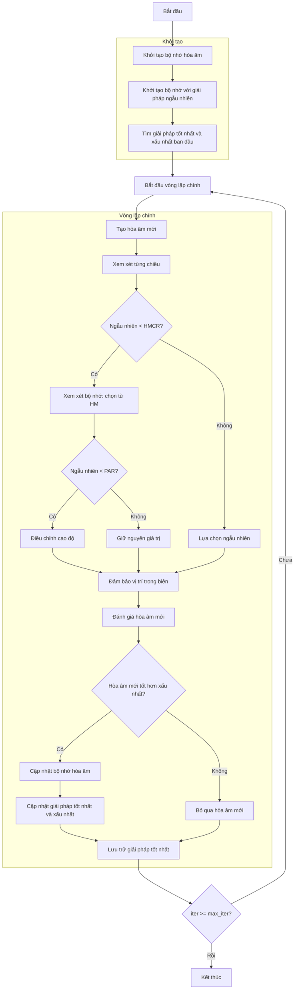

# Sơ đồ thuật toán Harmony Search Optimizer



### Giải thích chi tiết các bước:

1. **Khởi tạo bộ nhớ hòa âm**:
   - Khởi tạo ma trận bộ nhớ hòa âm (Harmony Memory)
   - Khởi tạo mảng fitness cho bộ nhớ
   ```python
   self.harmony_memory = np.zeros((self.hms, self.dim))
   self.harmony_fitness = np.zeros(self.hms)
   ```

2. **Khởi tạo bộ nhớ với giải pháp ngẫu nhiên**:
   - Tạo ngẫu nhiên các hòa âm ban đầu
   - Tính toán giá trị fitness cho từng hòa âm
   ```python
   self.harmony_memory[i] = np.random.uniform(self.lb, self.ub, self.dim)
   self.harmony_fitness[i] = self.objective_func(self.harmony_memory[i])
   ```

3. **Tìm giải pháp tốt nhất và xấu nhất ban đầu**:
   - Xác định chỉ số của hòa âm tốt nhất và xấu nhất
   - Lưu trữ giải pháp tốt nhất ban đầu

4. **Vòng lặp chính** (max_iter lần):
   - **Tạo hòa âm mới**:
     * Khởi tạo hòa âm mới với các giá trị bằng 0
   
   - **Xem xét từng chiều**:
     * Xử lý từng chiều của không gian tìm kiếm
   
   - **Quyết định xem xét bộ nhớ hoặc lựa chọn ngẫu nhiên**:
     * Nếu số ngẫu nhiên < HMCR (Harmony Memory Considering Rate):
       * **Xem xét bộ nhớ**: Chọn giá trị từ bộ nhớ hòa âm
       ```python
       harmony_idx = np.random.randint(0, self.hms)
       new_harmony[j] = self.harmony_memory[harmony_idx, j]
       ```
       * Nếu số ngẫu nhiên < PAR (Pitch Adjustment Rate):
         * **Điều chỉnh cao độ**: Thêm nhiễu với bandwidth
         ```python
         new_harmony[j] += self.bw * (2 * np.random.random() - 1)
         ```
     * Ngược lại:
       * **Lựa chọn ngẫu nhiên**: Chọn giá trị ngẫu nhiên trong biên
   
   - **Đảm bảo vị trí trong biên**:
     * Giữ các giá trị trong phạm vi [lb, ub]
   
   - **Đánh giá hòa âm mới**:
     * Tính toán giá trị hàm mục tiêu cho hòa âm mới
   
   - **Quyết định cập nhật bộ nhớ**:
     * Nếu hòa âm mới tốt hơn hòa âm xấu nhất trong bộ nhớ:
       * **Cập nhật bộ nhớ hòa âm**: Thay thế hòa âm xấu nhất
       * **Cập nhật giải pháp tốt nhất và xấu nhất**: Tìm lại các chỉ số
       ```python
       self.harmony_memory[worst_idx_current] = new_harmony
       self.harmony_fitness[worst_idx_current] = new_fitness
       ```
     * Ngược lại: Bỏ qua hòa âm mới
   
   - **Lưu trữ giải pháp tốt nhất**:
     * Lưu lại giải pháp tốt nhất tại mỗi lần lặp

5. **Kết thúc**:
   - Lưu trữ kết quả cuối cùng
   - Hiển thị lịch sử tối ưu hóa
   - Trả về giải pháp tốt nhất
