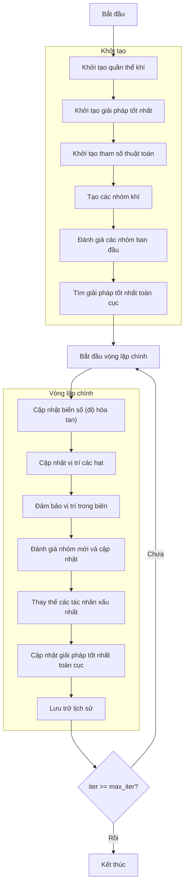

# Sơ đồ thuật toán Henry Gas Solubility Optimizer



### Giải thích chi tiết các bước:

1. **Khởi tạo quần thể khí**:
   - Tạo ngẫu nhiên các vị trí ban đầu cho các hạt khí
   - Mỗi hạt khí đại diện cho một giải pháp trong không gian tìm kiếm

2. **Khởi tạo giải pháp tốt nhất**:
   - Sắp xếp quần thể và chọn giải pháp tốt nhất ban đầu

3. **Khởi tạo tham số thuật toán**:
   - Khởi tạo hằng số Henry (K) ngẫu nhiên
   - Khởi tạo áp suất riêng phần (P) ngẫu nhiên
   - Khởi tạo hằng số (C) ngẫu nhiên
   ```python
   K = self.l1 * np.random.rand(self.n_types)
   P = self.l2 * np.random.rand(search_agents_no)
   C = self.l3 * np.random.rand(self.n_types)
   ```

4. **Tạo các nhóm khí**:
   - Chia quần thể thành các nhóm dựa trên số loại khí
   - Mỗi nhóm có số lượng hạt bằng nhau
   ```python
   groups = self._create_groups(population)
   ```

5. **Đánh giá các nhóm ban đầu**:
   - Tính toán giá trị fitness cho từng hạt trong nhóm
   - Tìm giải pháp tốt nhất cho từng nhóm
   ```python
   groups[i], group_best_fitness[i], group_best_positions[i] = self._evaluate_group(groups[i], None, True)
   ```

6. **Tìm giải pháp tốt nhất toàn cục**:
   - So sánh các giải pháp tốt nhất từ các nhóm
   - Chọn giải pháp tốt nhất toàn cục

7. **Vòng lặp chính** (max_iter lần):
   - **Cập nhật biến số (độ hòa tan)**:
     * Tính toán nhiệt độ dựa trên số lần lặp
     * Cập nhật hằng số Henry dựa trên nhiệt độ
     * Tính toán độ hòa tan cho từng nhóm
     ```python
     S = self._update_variables(search_agents_no, iter, max_iter, K, P, C)
     ```
   
   - **Cập nhật vị trí các hạt**:
     * Tính toán tham số gamma dựa trên fitness
     * Chọn hướng di chuyển ngẫu nhiên (1 hoặc -1)
     * Cập nhật vị trí dựa trên ảnh hưởng của nhóm tốt nhất và toàn cục tốt nhất
     ```python
     new_position[k] += group_best_influence + global_best_influence
     ```
   
   - **Đảm bảo vị trí trong biên**:
     * Giữ các vị trí trong phạm vi [lb, ub]
   
   - **Đánh giá nhóm mới và cập nhật**:
     * Tính toán giá trị fitness cho các hạt mới
     * Cập nhật nếu tìm thấy giải pháp tốt hơn
   
   - **Thay thế các tác nhân xấu nhất**:
     * Tính số lượng tác nhân xấu nhất cần thay thế
     * Thay thế bằng các vị trí ngẫu nhiên mới
     ```python
     groups[i] = self._worst_agents(groups[i])
     ```
   
   - **Cập nhật giải pháp tốt nhất toàn cục**:
     * So sánh và cập nhật nếu tìm thấy giải pháp tốt hơn
   
   - **Lưu trữ lịch sử**:
     * Lưu lại giải pháp tốt nhất tại mỗi lần lặp

### Chi tiết cập nhật độ hòa tan:

**Công thức nhiệt độ**:
```python
T = np.exp(-iter / max_iter)  # Giảm dần theo số lần lặp
```

**Cập nhật hằng số Henry**:
```python
K[j] = K[j] * np.exp(-C[j] * (1/T - 1/T0))  # T0 = 298.15
```

**Tính độ hòa tan**:
```python
S[start_idx:end_idx] = P[start_idx:end_idx] * K[j]
```

### Chi tiết cập nhật vị trí:

**Tham số gamma**:
```python
gamma = self.beta * np.exp(-(global_best_fitness + 0.05) / (current_fitness + 0.05))
```

**Ảnh hưởng nhóm tốt nhất**:
```python
group_best_influence = direction_flag * np.random.random() * gamma * (group_best_positions[i][k] - groups[i][j].position[k])
```

**Ảnh hưởng toàn cục tốt nhất**:
```python
global_best_influence = np.random.random() * self.alpha * direction_flag * (S[i * group_size + j] * global_best_position[k] - groups[i][j].position[k])
```

8. **Kết thúc**:
   - Lưu trữ kết quả cuối cùng
   - Hiển thị lịch sử tối ưu hóa
   - Trả về giải pháp tốt nhất
