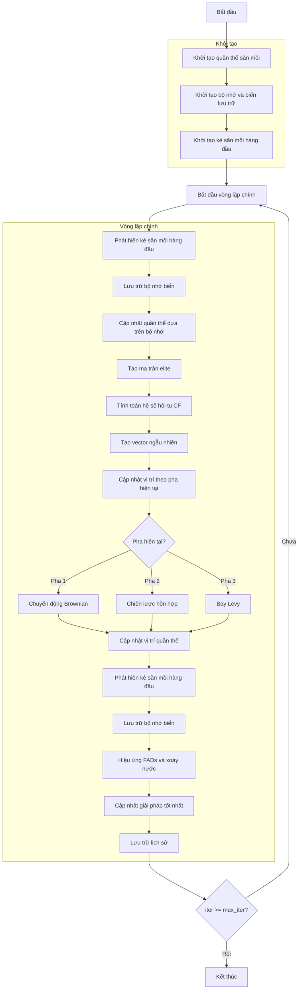

# Sơ đồ thuật toán Marine Predators Optimizer



### Giải thích chi tiết các bước:

1. **Khởi tạo quần thể săn mồi**:
   - Tạo ngẫu nhiên các vị trí ban đầu cho con mồi và kẻ săn mồi
   - Mỗi cá thể đại diện cho một giải pháp trong không gian tìm kiếm

2. **Khởi tạo bộ nhớ và biến lưu trữ**:
   - Khởi tạo bộ nhớ cho quần thể cũ và fitness
   - Khởi tạo lịch sử tối ưu hóa
   ```python
   Prey_old = [member.copy() for member in population]
   fit_old = np.array([member.fitness for member in population])
   ```

3. **Khởi tạo kẻ săn mồi hàng đầu**:
   - Khởi tạo vị trí và fitness cho kẻ săn mồi tốt nhất
   - Thiết lập ma trận biên cho hiệu ứng FADs
   ```python
   Top_predator_pos = np.zeros(self.dim)
   Top_predator_fit = np.inf if not self.maximize else -np.inf
   ```

4. **Vòng lặp chính** (max_iter lần):
   - **Phát hiện kẻ săn mồi hàng đầu**:
     * Đảm bảo vị trí trong biên
     * Tính toán fitness mới
     * Cập nhật kẻ săn mồi hàng đầu nếu tìm thấy giải pháp tốt hơn
   
   - **Lưu trữ bộ nhớ biển**:
     * Lưu trữ trạng thái quần thể hiện tại vào bộ nhớ
   
   - **Cập nhật quần thể dựa trên bộ nhớ**:
     * So sánh fitness hiện tại với fitness trong bộ nhớ
     * Cập nhật vị trí và fitness dựa trên kết quả so sánh
     ```python
     new_positions = np.where(Indx, old_positions, positions)
     new_fitness = np.where(Inx, fit_old, current_fitness)
     ```
   
   - **Tạo ma trận elite**:
     * Tạo ma trận chứa kẻ săn mồi hàng đầu lặp lại
     ```python
     Elite = np.tile(Top_predator_pos, (search_agents_no, 1))
     ```
   
   - **Tính toán hệ số hội tụ CF**:
     * Tính hệ số hội tụ giảm dần theo số lần lặp
     ```python
     CF = (1 - iter / max_iter) ** (2 * iter / max_iter)
     ```
   
   - **Tạo vector ngẫu nhiên**:
     * Tạo vector bay Levy và chuyển động Brownian
     ```python
     RL = 0.05 * self._levy_flight(search_agents_no, self.dim, 1.5)
     RB = np.random.randn(search_agents_no, self.dim)
     ```
   
   - **Cập nhật vị trí theo pha hiện tại**:
     * **Pha 1 (Iter < Max_iter/3)**: Chuyển động Brownian - Tốc độ cao
       ```python
       stepsize = RB[i, j] * (Elite[i, j] - RB[i, j] * positions[i, j])
       positions[i, j] = positions[i, j] + self.P * R * stepsize
       ```
     * **Pha 2 (Max_iter/3 < Iter < 2*Max_iter/3)**: Chiến lược hỗn hợp - Tốc độ đơn vị
       * Nửa trên: Chuyển động Brownian
       * Nửa dưới: Bay Levy
     * **Pha 3 (Iter > 2*Max_iter/3)**: Bay Levy - Tốc độ thấp
       ```python
       stepsize = RL[i, j] * (RL[i, j] * Elite[i, j] - positions[i, j])
       positions[i, j] = Elite[i, j] + self.P * CF * stepsize
       ```
   
   - **Hiệu ứng FADs và xoáy nước**:
     * Với xác suất FADs: Hiệu ứng thiết bị tập trung cá
       ```python
       U = np.random.rand(search_agents_no, self.dim) < self.FADs
       random_positions = Xmin + np.random.rand(search_agents_no, self.dim) * (Xmax - Xmin)
       positions = positions + CF * random_positions * U
       ```
     * Ngược lại: Hiệu ứng xoáy nước
       ```python
       stepsize = (self.FADs * (1 - r) + r) * (positions[idx1] - positions[idx2])
       positions = positions + stepsize
       ```
   
   - **Cập nhật giải pháp tốt nhất**:
     * So sánh và cập nhật nếu tìm thấy giải pháp tốt hơn
   
   - **Lưu trữ lịch sử**:
     * Lưu lại giải pháp tốt nhất tại mỗi lần lặp

5. **Kết thúc**:
   - Lưu trữ kết quả cuối cùng
   - Hiển thị lịch sử tối ưu hóa
   - Trả về giải pháp tốt nhất
