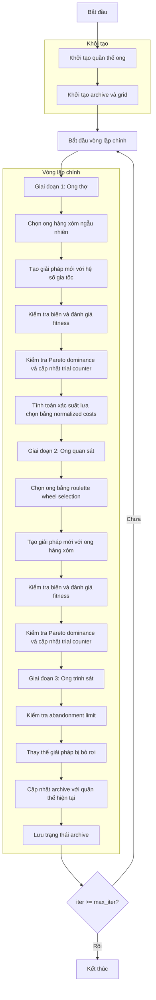

# Sơ đồ thuật toán Multi-Objective Artificial Bee Colony Optimizer



### Giải thích chi tiết các bước:

1. **Khởi tạo quần thể ong**: 
   - Tạo ngẫu nhiên các vị trí ban đầu trong không gian tìm kiếm
   - Mỗi vị trí X_i ∈ [lb, ub]^dim
   - Tính toán giá trị hàm mục tiêu đa mục tiêu
   - Khởi tạo trial counter = 0 cho mỗi ong

2. **Khởi tạo archive và grid**:
   - Xác định các giải pháp không bị chi phối từ quần thể ban đầu
   - Khởi tạo archive với các giải pháp không bị chi phối
   - Tạo grid để quản lý archive dựa trên không gian mục tiêu

3. **Vòng lặp chính** (max_iter lần):
   - **Giai đoạn 1: Ong thợ**:
     * Mỗi ong thợ tìm kiếm giải pháp mới

     - **Chọn ong hàng xóm ngẫu nhiên**:
       * Chọn một ong khác ngẫu nhiên từ quần thể

     - **Tạo giải pháp mới với hệ số gia tốc**:
       ```python
       phi = self.acceleration_coef * np.random.uniform(-1, 1, self.dim)
       new_position = population[i].position + phi * (population[i].position - population[k].position)
       ```

     - **Kiểm tra biên và đánh giá fitness**:
       * Đảm bảo vị trí nằm trong [lb, ub]
       * Tính toán giá trị hàm mục tiêu đa mục tiêu mới

     - **Kiểm tra Pareto dominance và cập nhật trial counter**:
       * Nếu giải pháp mới dominate giải pháp hiện tại: cập nhật và reset trial counter
       * Nếu không: tăng trial counter

   - **Tính toán xác suất lựa chọn bằng normalized costs**:
     * Tính tổng các mục tiêu đã được chuẩn hóa
     ```python
     normalized_costs = self._get_normalized_costs(population)
     fitness_values = 1.0 / (np.sum(normalized_costs, axis=1) + 1e-10)
     probabilities = fitness_values / np.sum(fitness_values)
     ```

   - **Giai đoạn 2: Ong quan sát**:
     * Ong quan sát chọn ong thợ dựa trên xác suất

     - **Chọn ong bằng roulette wheel selection**:
       * Sử dụng lựa chọn tỷ lệ fitness

     - **Tạo giải pháp mới với ong hàng xóm**:
       * Tương tự giai đoạn ong thợ

     - **Kiểm tra biên và đánh giá fitness**:
       * Đảm bảo vị trí hợp lệ

     - **Kiểm tra Pareto dominance và cập nhật trial counter**:
       * Cập nhật giải pháp nếu dominate

   - **Giai đoạn 3: Ong trinh sát**:
     * Thay thế các giải pháp không cải thiện

     - **Kiểm tra abandonment limit**:
       * Nếu trial counter >= abandonment_limit

     - **Thay thế giải pháp bị bỏ rơi**:
       * Tạo giải pháp ngẫu nhiên mới
       * Reset trial counter

   - **Cập nhật archive với quần thể hiện tại**:
     * Thêm các giải pháp không bị chi phối vào archive
     * Duy trì kích thước archive bằng cách loại bỏ các giải pháp dư thừa
     * Cập nhật grid để phản ánh archive mới

   - **Lưu trạng thái archive**:
     * Lưu trữ archive hiện tại cho lịch sử tối ưu hóa

4. **Kết thúc**:
   - Lưu trữ kết quả cuối cùng
   - Trả về archive (tập các giải pháp Pareto tối ưu) và lịch sử
