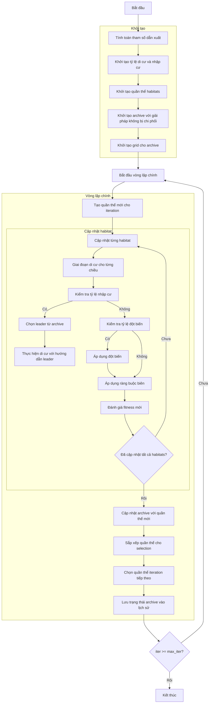

# Sơ đồ thuật toán Multi-Objective Biogeography Based Optimizer



### Giải thích chi tiết các bước:

1. **Tính toán tham số dẫn xuất**:
   - Tính số habitats cần giữ lại (n_keep) dựa trên keep_rate
   - Tính số habitats mới cần tạo (n_new)
   ```python
   n_keep = round(self.keep_rate * search_agents_no)
   n_new = search_agents_no - n_keep
   ```

2. **Khởi tạo tỷ lệ di cư và nhập cư**:
   - Tỷ lệ di cư (emigration) giảm dần từ 1 đến 0
   - Tỷ lệ nhập cư (immigration) tăng dần từ 0 đến 1
   ```python
   mu = np.linspace(1, 0, search_agents_no)  # Emigration rates
   lambda_rates = 1 - mu  # Immigration rates
   ```

3. **Khởi tạo quần thể habitats**:
   - Tạo ngẫu nhiên các habitats ban đầu
   - Mỗi habitat có vị trí X_i ∈ [lb, ub]^dim

4. **Khởi tạo archive với giải pháp không bị chi phối**:
   - Xác định các giải pháp không bị chi phối trong quần thể ban đầu
   - Thêm các giải pháp này vào archive

5. **Khởi tạo grid cho archive**:
   - Tạo hypercubes để quản lý archive
   - Gán chỉ số grid cho từng giải pháp trong archive

6. **Tạo quần thể mới cho iteration**:
   - Tạo bản sao của quần thể hiện tại
   ```python
   new_population = [member.copy() for member in population]
   ```

7. **Cập nhật từng habitat**:
   - Duyệt qua từng habitat trong quần thể

8. **Giai đoạn di cư cho từng chiều**:
   - Duyệt qua từng chiều của không gian tìm kiếm

9. **Kiểm tra tỷ lệ nhập cư**:
   - Nếu số ngẫu nhiên ≤ tỷ lệ nhập cư, thực hiện di cư
   ```python
   if np.random.random() <= lambda_rates[i]:
   ```

10. **Chọn leader từ archive**:
    - Sử dụng grid-based selection để chọn leader từ archive
    - Nếu archive rỗng, chọn ngẫu nhiên từ quần thể

11. **Thực hiện di cư với hướng dẫn leader**:
    - Cập nhật vị trí dựa trên leader
    ```python
    new_population[i].position[k] = (
        population[i].position[k] + 
        self.migration_alpha * (leader.position[k] - population[i].position[k])
    )
    ```

12. **Kiểm tra tỷ lệ đột biến**:
    - Nếu số ngẫu nhiên ≤ xác suất đột biến, thực hiện đột biến
    ```python
    if np.random.random() <= self.p_mutation:
    ```

13. **Áp dụng đột biến**:
    - Thêm nhiễu Gaussian vào vị trí
    ```python
    new_population[i].position[k] += self.sigma[k] * np.random.randn()
    ```

14. **Áp dụng ràng buộc biên**:
    - Đảm bảo vị trí nằm trong biên [lb, ub]
    ```python
    new_population[i].position = np.clip(new_population[i].position, self.lb, self.ub)
    ```

15. **Đánh giá fitness mới**:
    - Tính toán giá trị fitness đa mục tiêu mới
    ```python
    new_population[i].multi_fitness = self.objective_func(new_population[i].position)
    ```

16. **Cập nhật archive với quần thể mới**:
    - Thêm các giải pháp không bị chi phối mới vào archive
    - Loại bỏ các giải pháp bị chi phối

17. **Sắp xếp quần thể cho selection**:
    - Sắp xếp quần thể dựa trên Pareto dominance
    ```python
    sorted_population_new = self._sort_population(new_population)
    sorted_population = self._sort_population(population)
    ```

18. **Chọn quần thể iteration tiếp theo**:
    - Giữ lại habitats tốt nhất từ quần thể cũ
    - Thêm habitats tốt nhất từ quần thể mới
    ```python
    next_population = sorted_population[:n_keep] + sorted_population_new[:n_new]
    ```

19. **Lưu trạng thái archive vào lịch sử**:
    - Lưu trữ bản sao của archive tại mỗi iteration

20. **Kết thúc**:
    - Trả về lịch sử archive và archive cuối cùng
    - Hiển thị kết quả tối ưu hóa
