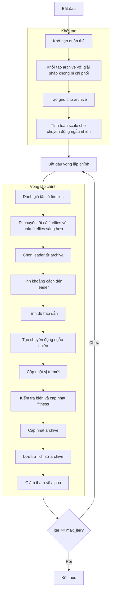

# Sơ đồ thuật toán Multi Objective Firefly Optimizer



### Giải thích chi tiết các bước:

1. **Khởi tạo quần thể**: 
   - Tạo ngẫu nhiên các vị trí ban đầu trong không gian tìm kiếm
   - Mỗi vị trí X_i ∈ [lb, ub]^dim
   - Tính toán giá trị hàm mục tiêu multi_fitness = objective_func(X_i)

2. **Khởi tạo archive với giải pháp không bị chi phối**:
   - Xác định các giải pháp không bị chi phối trong quần thể ban đầu
   - Thêm các giải pháp này vào archive bên ngoài

3. **Tạo grid cho archive**:
   - Tạo lưới hypercubes để quản lý archive
   - Gán chỉ số grid cho từng giải pháp trong archive

4. **Tính toán scale cho chuyển động ngẫu nhiên**:
   ```python
   scale = np.abs(self.ub - self.lb)
   ```

5. **Vòng lặp chính** (max_iter lần):
   - **Đánh giá tất cả fireflies**: Tính toán lại giá trị hàm mục tiêu cho mỗi firefly
   
   - **Di chuyển tất cả fireflies về phía fireflies sáng hơn**:
     * Chọn leader từ archive sử dụng grid-based selection
     * Tính khoảng cách Euclidean đến leader:
       ```python
       r = np.sqrt(np.sum((current.position - leader.position)**2))
       ```
     * Tính độ hấp dẫn:
       ```python
       beta = (1.0 - betamin) * exp(-gamma * r**2) + betamin
       ```
     * Tạo chuyển động ngẫu nhiên:
       ```python
       random_move = alpha * (np.random.random(dim) - 0.5) * scale
       ```
     * Cập nhật vị trí:
       ```python
       new_position = current.position * (1 - beta) + leader.position * beta + random_move
       ```
   
   - **Kiểm tra biên và cập nhật fitness**:
     * Đảm bảo vị trí nằm trong biên [lb, ub]
     * Tính toán lại giá trị hàm mục tiêu
   
   - **Cập nhật archive**: Thêm các giải pháp không bị chi phối mới vào archive
   
   - **Lưu trữ lịch sử archive**: Lưu trạng thái archive hiện tại
   
   - **Giảm tham số alpha**: Giảm độ ngẫu nhiên theo thời gian:
     ```python
     alpha = alpha * alpha_delta
     ```

6. **Kết thúc**:
   - Lưu trữ kết quả cuối cùng
   - Trả về lịch sử archive và archive cuối cùng
