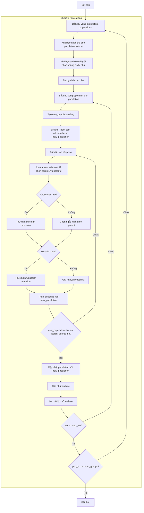

# Sơ đồ thuật toán Multi Objective Genetic Algorithm Optimizer



### Giải thích chi tiết các bước:

1. **Bắt đầu vòng lặp multiple populations** (num_groups lần):
   - Chạy nhiều population độc lập để tăng đa dạng
   - Mỗi population có quá trình tiến hóa riêng

2. **Khởi tạo quần thể cho population hiện tại**: 
   - Tạo ngẫu nhiên các vị trí ban đầu
   - Mỗi vị trí X_i ∈ [lb, ub]^dim
   - Tính toán giá trị hàm mục tiêu multi_fitness = objective_func(X_i)

3. **Khởi tạo archive với giải pháp không bị chi phối**:
   - Xác định các giải pháp không bị chi phối trong quần thể ban đầu
   - Thêm các giải pháp này vào archive bên ngoài

4. **Tạo grid cho archive**:
   - Tạo lưới hypercubes để quản lý archive
   - Gán chỉ số grid cho từng giải pháp trong archive

5. **Vòng lặp chính cho population** (max_iter lần):
   - **Tạo new_population rỗng**: Chuẩn bị population mới
   
   - **Elitism: Thêm best individuals vào new_population**:
     * Giữ lại các giải pháp tốt nhất từ population hiện tại
     * Số lượng elitism: search_agents_no // 4
     ```python
     elite_count = min(len(non_dominated_pop), search_agents_no // 4)
     new_population.extend(non_dominated_pop[:elite_count])
     ```
   
   - **Bắt đầu tạo offspring**: Tạo offspring cho đến khi đủ population size
   
   - **Tournament selection để chọn parent1 và parent2**:
     * Sử dụng tournament selection với kích thước tournament_size
     * Tournament selection sử dụng grid-based diversity cho multi-objective
     ```python
     parent1 = self._tournament_selection_multi(population, self.tournament_size)
     parent2 = self._tournament_selection_multi(population, self.tournament_size)
     ```
   
   - **Quyết định crossover**:
     * Với xác suất crossover_rate: thực hiện uniform crossover
     * Ngược lại: chọn ngẫu nhiên một parent
     ```python
     if np.random.random() < self.crossover_rate:
         child = self._uniform_crossover(parent1, parent2)
     else:
         child = parent1.copy() if np.random.random() < 0.5 else parent2.copy()
     ```
   
   - **Quyết định mutation**:
     * Với xác suất mutation_rate: thực hiện Gaussian mutation
     * Ngược lại: giữ nguyên offspring
     ```python
     if np.random.random() < self.mutation_rate:
         child = self._mutation(child)
     ```
   
   - **Thêm offspring vào new_population**: Thêm offspring đã tạo
   
   - **Cập nhật population với new_population**: Thay thế population cũ
   
   - **Cập nhật archive**: Thêm các giải pháp không bị chi phối mới vào archive
   
   - **Lưu trữ lịch sử archive**: Lưu trạng thái archive hiện tại

6. **Kết thúc**:
   - Lưu trữ kết quả cuối cùng
   - Trả về lịch sử archive và archive cuối cùng

### Chi tiết Genetic Operators:

**Uniform Crossover**:
```python
def _uniform_crossover(self, parent1, parent2):
    child_position = np.zeros(self.dim)
    for d in range(self.dim):
        if np.random.random() < 0.5:  # 50% chance from each parent
            child_position[d] = parent1.position[d]
        else:
            child_position[d] = parent2.position[d]
    return MultiObjectiveMember(child_position, self.objective_func(child_position))
```

**Gaussian Mutation**:
```python
def _mutation(self, individual):
    mutated_position = individual.position.copy()
    for d in range(self.dim):
        if np.random.random() < self.mutation_rate:
            mutation_strength = 0.1 * (self.ub[d] - self.lb[d])
            mutated_position[d] += np.random.normal(0, mutation_strength)
    return MultiObjectiveMember(mutated_position, self.objective_func(mutated_position))
```

**Tournament Selection (Multi-Objective)**:
- Sử dụng grid-based diversity để chọn parents
- Ưu tiên các solutions từ các grid cell ít đông đúc
- Kết hợp non-dominated sorting và diversity maintenance

### Tham số Genetic Algorithm:

**Tham số chính**:
- `num_groups` (5): Số lượng populations độc lập
- `crossover_rate` (0.8): Xác suất crossover
- `mutation_rate` (0.1): Xác suất mutation  
- `tournament_size` (3): Kích thước tournament selection

**Đặc điểm của GA đa mục tiêu**:
- Sử dụng multiple populations để tăng đa dạng
- Elitism để bảo tồn solutions tốt
- Tournament selection với grid-based diversity
- Archive management để duy trì Pareto front
- Uniform crossover và Gaussian mutation cho variation
