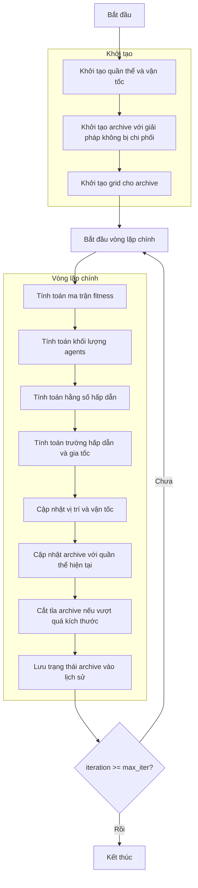

# Sơ đồ thuật toán Multi-Objective Gravitational Search Optimizer



### Giải thích chi tiết các bước:

1. **Khởi tạo quần thể và vận tốc**:
   - Tạo ngẫu nhiên các vị trí ban đầu trong không gian tìm kiếm
   - Khởi tạo vận tốc ban đầu bằng 0 cho tất cả agents
   - Mỗi agent có vị trí X_i ∈ [lb, ub]^dim và vận tốc V_i

2. **Khởi tạo archive với giải pháp không bị chi phối**:
   - Xác định các giải pháp không bị chi phối trong quần thể ban đầu
   - Thêm các giải pháp này vào archive

3. **Khởi tạo grid cho archive**:
   - Tạo hypercubes để quản lý archive
   - Gán chỉ số grid cho từng giải pháp trong archive

4. **Tính toán ma trận fitness**:
   - Trích xuất giá trị fitness đa mục tiêu từ quần thể
   ```python
   fitness_matrix = np.array([member.multi_fitness for member in population])
   ```

5. **Tính toán khối lượng agents**:
   - Tính toán khối lượng dựa trên fitness đa mục tiêu
   - Chuẩn hóa các giá trị fitness và tính tổng
   ```python
   masses = self._mass_calculation(fitness_matrix)
   ```

6. **Tính toán hằng số hấp dẫn**:
   - Hằng số hấp dẫn giảm dần theo số lần lặp
   ```python
   g = self.g0 * np.exp(-self.alpha * float(iteration) / max_iter)
   ```

7. **Tính toán trường hấp dẫn và gia tốc**:
   - Tính toán lực hấp dẫn giữa các agents
   - Xác định kbest agents tốt nhất để xem xét
   - Tính toán gia tốc cho từng agent

8. **Cập nhật vị trí và vận tốc**:
   - Cập nhật vận tốc dựa trên gia tốc
   - Cập nhật vị trí dựa trên vận tốc
   - Đảm bảo vị trí nằm trong biên [lb, ub]
   ```python
   self.velocities[i, d] = rand_val * self.velocities[i, d] + accelerations[i, d]
   positions[i, d] = positions[i, d] + self.velocities[i, d]
   ```

9. **Cập nhật archive với quần thể hiện tại**:
   - Thêm các giải pháp không bị chi phối mới vào archive
   - Loại bỏ các giải pháp bị chi phối khỏi archive

10. **Cắt tỉa archive nếu vượt quá kích thước**:
    - Sử dụng grid-based selection để duy trì kích thước archive
    - Ưu tiên giữ lại các giải pháp trong các hypercube ít đông đúc

11. **Lưu trạng thái archive vào lịch sử**:
    - Lưu trữ bản sao của archive tại mỗi iteration để theo dõi tiến trình

12. **Kết thúc**:
    - Trả về lịch sử archive và archive cuối cùng
    - Hiển thị kết quả tối ưu hóa
