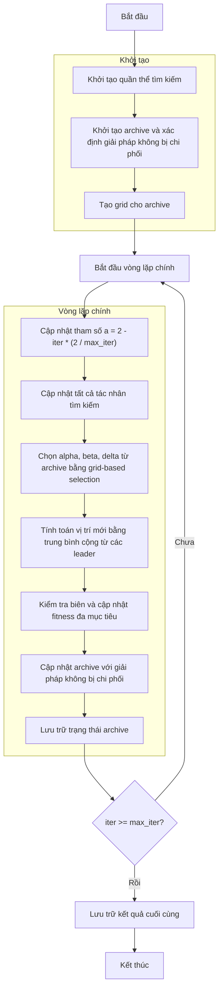

# Sơ đồ thuật toán Multi-Objective Grey Wolf Optimizer



### Giải thích chi tiết các bước:

1. **Khởi tạo quần thể tìm kiếm**:
   - Tạo ngẫu nhiên các vị trí ban đầu trong không gian tìm kiếm
   - Mỗi vị trí X_i ∈ [lb, ub]^dim
   - Tính toán giá trị hàm mục tiêu đa chiều objective_func(X_i)

2. **Khởi tạo archive và xác định giải pháp không bị chi phối**:
   - Xác định các giải pháp không bị chi phối từ quần thể ban đầu
   - Thêm các giải pháp không bị chi phối vào archive
   ```python
   self._determine_domination(population)
   non_dominated = self._get_non_dominated_particles(population)
   self.archive.extend(non_dominated)
   ```

3. **Tạo grid cho archive**:
   - Tạo hypercubes để quản lý archive
   - Gán chỉ số grid cho từng giải pháp trong archive
   ```python
   self.grid = self._create_hypercubes(costs)
   particle.grid_index, particle.grid_sub_index = self._get_grid_index(particle)
   ```

4. **Vòng lặp chính** (max_iter lần):
   - **Cập nhật tham số a**:
     * Giảm tuyến tính từ 2 về 0 theo số lần lặp
     ```python
     a = 2 - iter * (2 / max_iter)
     ```

   - **Chọn alpha, beta, delta từ archive**:
     * Sử dụng grid-based selection để chọn các leader
     * Nếu không đủ leader, bổ sung từ quần thể ngẫu nhiên
     ```python
     leaders = self._select_multiple_leaders(3)
     ```

   - **Tính toán vị trí mới bằng trung bình cộng**:
     * Mỗi leader đóng góp như nhau (không có trọng số)
     * Tính tổng đóng góp từ tất cả leaders rồi lấy trung bình
     ```python
     new_position[j] += X
     new_position[j] /= len(leaders)
     ```

   - **Kiểm tra biên và cập nhật fitness đa mục tiêu**:
     * Đảm bảo vị trí nằm trong biên [lb, ub]
     * Tính toán lại giá trị hàm mục tiêu đa chiều

   - **Cập nhật archive với giải pháp không bị chi phối**:
     * Thêm các giải pháp mới không bị chi phối vào archive
     * Duy trì kích thước archive bằng cách loại bỏ giải pháp dư thừa

   - **Lưu trữ trạng thái archive**:
     * Lưu lại trạng thái archive tại mỗi iteration để theo dõi tiến trình

5. **Kết thúc**:
   - Lưu trữ kết quả cuối cùng (archive chứa tập Pareto front)
   - Hiển thị lịch sử tối ưu hóa
   - Trả về archive và lịch sử
