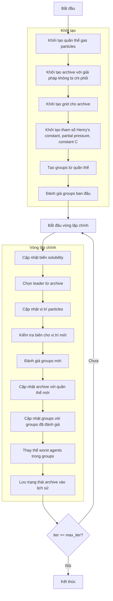

# Sơ đồ thuật toán Multi-Objective Henry Gas Solubility Optimizer



### Giải thích chi tiết các bước:

1. **Khởi tạo quần thể gas particles**:
   - Tạo ngẫu nhiên các vị trí ban đầu trong không gian tìm kiếm
   - Mỗi particle có vị trí X_i ∈ [lb, ub]^dim

2. **Khởi tạo archive với giải pháp không bị chi phối**:
   - Xác định các giải pháp không bị chi phối trong quần thể ban đầu
   - Thêm các giải pháp này vào archive

3. **Khởi tạo grid cho archive**:
   - Tạo hypercubes để quản lý archive
   - Gán chỉ số grid cho từng giải pháp trong archive

4. **Khởi tạo tham số Henry's constant, partial pressure, constant C**:
   - Khởi tạo các tham số vật lý cho mô hình hòa tan khí
   ```python
   K = self.l1 * np.random.rand(self.n_types)  # Henry's constants
   P = self.l2 * np.random.rand(search_agents_no)  # Partial pressures
   C = self.l3 * np.random.rand(self.n_types)  # Constants
   ```

5. **Tạo groups từ quần thể**:
   - Chia quần thể thành các groups dựa trên số loại khí
   ```python
   group_size = len(population) // self.n_types
   groups = [[] for _ in range(self.n_types)]
   ```

6. **Đánh giá groups ban đầu**:
   - Tính toán fitness đa mục tiêu cho từng group
   - Xác định best member cho từng group
   ```python
   for i in range(self.n_types):
       groups[i], group_best_members[i] = self._evaluate_group_multi(groups[i], None, True)
   ```

7. **Cập nhật biến solubility**:
   - Tính toán nhiệt độ và cập nhật Henry's constant
   - Tính toán độ hòa tan (solubility) cho từng particle
   ```python
   T = np.exp(-iter / max_iter)  # Temperature
   K[j] = K[j] * np.exp(-C[j] * (1/T - 1/T0))
   S[start_idx:end_idx] = P[start_idx:end_idx] * K[j]
   ```

8. **Chọn leader từ archive**:
   - Sử dụng grid-based selection để chọn leader từ archive
   - Nếu archive rỗng, sử dụng best member từ group đầu tiên

9. **Cập nhật vị trí particles**:
   - Cập nhật vị trí dựa trên ảnh hưởng của group best và leader
   - Tính toán gamma parameter dựa trên fitness
   ```python
   gamma = self.beta * np.exp(-(leader_fitness + 0.05) / (current_fitness + 0.05))
   new_position[k] += group_best_influence + leader_influence
   ```

10. **Kiểm tra biên cho vị trí mới**:
    - Đảm bảo vị trí particles nằm trong biên [lb, ub]
    ```python
    groups[i][j].position = np.clip(groups[i][j].position, self.lb, self.ub)
    ```

11. **Đánh giá groups mới**:
    - Tính toán fitness đa mục tiêu cho groups mới
    - Cập nhật best member cho từng group

12. **Cập nhật archive với quần thể mới**:
    - Thêm các giải pháp không bị chi phối mới vào archive
    - Loại bỏ các giải pháp bị chi phối
    ```python
    self._add_to_archive(new_population)
    ```

13. **Cập nhật groups với groups đã đánh giá**:
    - Cập nhật groups với thông tin fitness và vị trí mới

14. **Thay thế worst agents trong groups**:
    - Xác định số lượng worst agents cần thay thế
    - Thay thế worst agents bằng vị trí ngẫu nhiên mới
    ```python
    Nw = int(round((M2N - M1N) * np.random.random() + M1N))
    ```

15. **Lưu trạng thái archive vào lịch sử**:
    - Lưu trữ bản sao của archive tại mỗi iteration
    ```python
    history_archive.append([member.copy() for member in self.archive])
    ```

16. **Kết thúc**:
    - Trả về lịch sử archive và archive cuối cùng
    - Hiển thị kết quả tối ưu hóa

### Công thức vật lý quan trọng:

#### Henry's Law:
```python
# Henry's constant update
K[j] = K[j] * np.exp(-C[j] * (1/T - 1/T0))

# Solubility calculation
S = P * K  # Solubility = Partial Pressure × Henry's Constant
```

#### Position Update:
```python
# Group best influence
group_best_influence = direction_flag * np.random.random() * gamma * (group_best.position[k] - current.position[k])

# Leader influence  
leader_influence = np.random.random() * self.alpha * direction_flag * (S * leader.position[k] - current.position[k])

# Total update
new_position[k] += group_best_influence + leader_influence
```

### Tham số quan trọng:
- **n_types**: Số loại khí (số groups)
- **l1, l2, l3**: Hằng số cho Henry's constant, partial pressure, và constant C
- **alpha, beta**: Hằng số cập nhật vị trí
- **M1, M2**: Phần trăm worst agents cần thay thế
- **archive_size**: Kích thước archive

### Đặc điểm của Multi-Objective HGSO:
- Mô phỏng định luật Henry về hòa tan khí trong chất lỏng
- Sử dụng multiple groups để duy trì đa dạng
- Kết hợp ảnh hưởng từ group best và archive leader
- Tự động thay thế worst agents để tránh local optima
- Archive management cho multi-objective optimization
