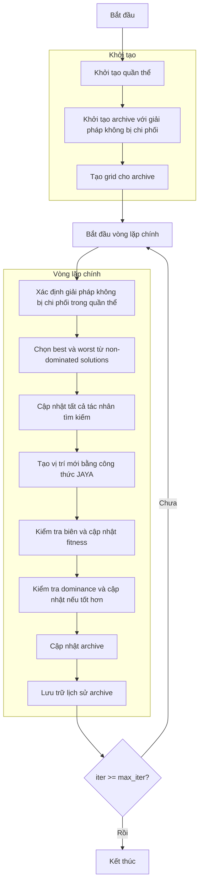

# Sơ đồ thuật toán Multi Objective JAYA Optimizer



### Giải thích chi tiết các bước:

1. **Khởi tạo quần thể**: 
   - Tạo ngẫu nhiên các vị trí ban đầu trong không gian tìm kiếm
   - Mỗi vị trí X_i ∈ [lb, ub]^dim
   - Tính toán giá trị hàm mục tiêu multi_fitness = objective_func(X_i)

2. **Khởi tạo archive với giải pháp không bị chi phối**:
   - Xác định các giải pháp không bị chi phối trong quần thể ban đầu
   - Thêm các giải pháp này vào archive bên ngoài

3. **Tạo grid cho archive**:
   - Tạo lưới hypercubes để quản lý archive
   - Gán chỉ số grid cho từng giải pháp trong archive

4. **Vòng lặp chính** (max_iter lần):
   - **Xác định giải pháp không bị chi phối trong quần thể**: 
     * Sử dụng phương thức `_determine_domination()` để xác định dominance
     * Lấy các giải pháp không bị chi phối bằng `_get_non_dominated_particles()`

   - **Chọn best và worst từ non-dominated solutions**:
     * Sử dụng grid-based selection để chọn 2 leaders từ archive
     * Nếu không đủ leaders, sử dụng random selection
     ```python
     leaders = self._select_multiple_leaders(2)
     best_member = leaders[0]
     worst_member = leaders[1]
     ```

   - **Cập nhật tất cả tác nhân tìm kiếm**:
     * Duyệt qua từng tác nhân trong quần thể

   - **Tạo vị trí mới bằng công thức JAYA**:
     * Áp dụng công thức JAYA cho từng chiều:
     ```python
     new_position[j] = (
         population[i].position[j] + 
         rand1 * (best_member.position[j] - abs(population[i].position[j])) - 
         rand2 * (worst_member.position[j] - abs(population[i].position[j]))
     )
     ```

   - **Kiểm tra biên và cập nhật fitness**:
     * Đảm bảo vị trí nằm trong biên [lb, ub] bằng `np.clip()`
     * Tính toán lại giá trị hàm mục tiêu

   - **Kiểm tra dominance và cập nhật nếu tốt hơn**:
     * Sử dụng `_dominates()` để kiểm tra nếu giải pháp mới tốt hơn giải pháp hiện tại
     * Nếu tốt hơn, cập nhật vị trí và fitness

   - **Cập nhật archive**: Thêm các giải pháp không bị chi phối mới vào archive
   
   - **Lưu trữ lịch sử archive**: Lưu trạng thái archive hiện tại

5. **Kết thúc**:
   - Lưu trữ kết quả cuối cùng
   - Trả về lịch sử archive và archive cuối cùng
