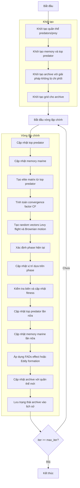

# Sơ đồ thuật toán Multi-Objective Marine Predators Optimizer



### Giải thích chi tiết các bước:

1. **Khởi tạo quần thể predators/prey**:
   - Tạo ngẫu nhiên các vị trí ban đầu trong không gian tìm kiếm
   - Mỗi predator/prey có vị trí X_i ∈ [lb, ub]^dim

2. **Khởi tạo memory và top predator**:
   - Khởi tạo memory cho previous population và fitness
   - Khởi tạo top predator với giá trị ban đầu
   ```python
   Prey_old = [member.copy() for member in population]
   fit_old = np.array([member.multi_fitness for member in population])
   Top_predator_pos = np.zeros(self.dim)
   ```

3. **Khởi tạo archive với giải pháp không bị chi phối**:
   - Xác định các giải pháp không bị chi phối trong quần thể ban đầu
   - Thêm các giải pháp này vào archive

4. **Khởi tạo grid cho archive**:
   - Tạo hypercubes để quản lý archive
   - Gán chỉ số grid cho từng giải pháp trong archive

5. **Cập nhật top predator**:
   - Tìm predator tốt nhất dựa trên Pareto dominance
   - Cập nhật top predator position và fitness
   ```python
   if self._dominates(member, MultiObjectiveMember(Top_predator_pos, Top_predator_fit)):
       Top_predator_fit = member.multi_fitness.copy()
       Top_predator_pos = member.position.copy()
   ```

6. **Cập nhật memory marine**:
   - So sánh current population với memory
   - Giữ lại solutions tốt hơn từ memory
   ```python
   if self._dominates(old_member, population[i]):
       Inx[i] = True
   ```

7. **Tạo elite matrix từ top predator**:
   - Tạo ma trận elite bằng cách replicate top predator
   ```python
   Elite = np.tile(Top_predator_pos, (search_agents_no, 1))
   ```

8. **Tính toán convergence factor CF**:
   - Tính toán hệ số hội tụ giảm dần theo iteration
   ```python
   CF = (1 - iter / max_iter) ** (2 * iter / max_iter)
   ```

9. **Tạo random vectors Levy flight và Brownian motion**:
   - Tạo vector ngẫu nhiên cho Levy flight và Brownian motion
   ```python
   RL = 0.05 * self._levy_flight(search_agents_no, self.dim, 1.5)
   RB = np.random.randn(search_agents_no, self.dim)
   ```

10. **Xác định phase hiện tại**:
    - Xác định phase dựa trên số iteration:
      - **Phase 1**: iter < max_iter/3 (High velocity ratio)
      - **Phase 2**: max_iter/3 < iter < 2*max_iter/3 (Unit velocity ratio)
      - **Phase 3**: iter > 2*max_iter/3 (Low velocity ratio)

11. **Cập nhật vị trí dựa trên phase**:
    - **Phase 1**: Brownian motion với high exploration
    - **Phase 2**: Mixed strategy (Brownian + Levy flight)
    - **Phase 3**: Levy flight với high exploitation

12. **Kiểm tra biên và cập nhật fitness**:
    - Đảm bảo vị trí nằm trong biên [lb, ub]
    - Tính toán giá trị fitness đa mục tiêu mới
    ```python
    member.position = np.clip(member.position, self.lb, self.ub)
    member.multi_fitness = self.objective_func(member.position)
    ```

13. **Áp dụng FADs effect hoặc Eddy formation**:
    - Với xác suất FADs, áp dụng Fish Aggregating Devices effect
    - Ngược lại, áp dụng Eddy formation effect
    ```python
    if np.random.random() < self.FADs:
        # FADs effect
        U = np.random.rand(search_agents_no, self.dim) < self.FADs
        random_positions = Xmin + np.random.rand(search_agents_no, self.dim) * (Xmax - Xmin)
        positions = positions + CF * random_positions * U
    else:
        # Eddy formation effect
        r = np.random.random()
        stepsize = (self.FADs * (1 - r) + r) * (positions[idx1] - positions[idx2])
        positions = positions + stepsize
    ```

14. **Cập nhật archive với quần thể mới**:
    - Thêm các giải pháp không bị chi phối mới vào archive
    - Loại bỏ các giải pháp bị chi phối
    ```python
    self._add_to_archive(population)
    ```

15. **Lưu trạng thái archive vào lịch sử**:
    - Lưu trữ bản sao của archive tại mỗi iteration
    ```python
    history_archive.append([member.copy() for member in self.archive])
    ```

16. **Kết thúc**:
    - Trả về lịch sử archive và archive cuối cùng
    - Hiển thị kết quả tối ưu hóa

### Các Phase của MPA:

#### Phase 1 (High Velocity Ratio - Exploration):
```python
# Brownian motion với high exploration
stepsize = RB[i, j] * (Elite[i, j] - RB[i, j] * positions[i, j])
positions[i, j] = positions[i, j] + self.P * R * stepsize
```

#### Phase 2 (Unit Velocity Ratio - Balanced):
```python
# Mixed strategy: Brownian + Levy flight
if i > search_agents_no / 2:
    stepsize = RB[i, j] * (RB[i, j] * Elite[i, j] - positions[i, j])
    positions[i, j] = Elite[i, j] + self.P * CF * stepsize
else:
    stepsize = RL[i, j] * (Elite[i, j] - RL[i, j] * positions[i, j])
    positions[i, j] = positions[i, j] + self.P * R * stepsize
```

#### Phase 3 (Low Velocity Ratio - Exploitation):
```python
# Levy flight với high exploitation
stepsize = RL[i, j] * (RL[i, j] * Elite[i, j] - positions[i, j])
positions[i, j] = Elite[i, j] + self.P * CF * stepsize
```

### Tham số quan trọng:
- **FADs**: Xác suất Fish Aggregating Devices effect
- **P**: Memory rate parameter
- **CF**: Convergence factor (giảm dần theo iteration)
- **archive_size**: Kích thước archive

### Đặc điểm của Multi-Objective MPA:
- Mô phỏng hành vi săn mồi của động vật biển
- 3 phases với chiến lược di chuyển khác nhau
- Sử dụng Levy flight và Brownian motion
- Memory mechanism để lưu trữ solutions tốt
- Archive management cho multi-objective optimization
- FADs effect và Eddy formation để tránh local optima
