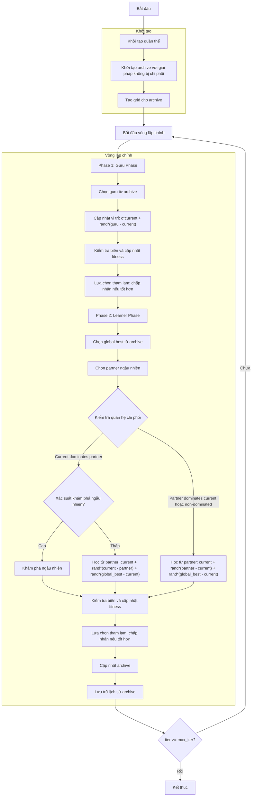

# Sơ đồ thuật toán Multi Objective Modified Social Group Optimizer



### Giải thích chi tiết các bước:

1. **Khởi tạo quần thể**: 
   - Tạo ngẫu nhiên các vị trí ban đầu trong không gian tìm kiếm
   - Mỗi vị trí X_i ∈ [lb, ub]^dim
   - Tính toán giá trị hàm mục tiêu multi_fitness = objective_func(X_i)

2. **Khởi tạo archive với giải pháp không bị chi phối**:
   - Xác định các giải pháp không bị chi phối trong quần thể ban đầu
   - Thêm các giải pháp này vào archive bên ngoài

3. **Tạo grid cho archive**:
   - Tạo lưới hypercubes để quản lý archive
   - Gán chỉ số grid cho từng giải pháp trong archive

4. **Vòng lặp chính** (max_iter lần):
   - **Phase 1: Guru Phase** (học từ người giỏi nhất):
     * Chọn guru từ archive sử dụng grid-based selection
     * Cập nhật vị trí:
       ```python
       new_position[j] = c * current.position[j] + random * (guru.position[j] - current.position[j])
       ```
     * Kiểm tra biên và cập nhật fitness
     * Lựa chọn tham lam: chấp nhận giải pháp mới nếu nó chi phối giải pháp hiện tại hoặc không bị chi phối
   
   - **Phase 2: Learner Phase** (học lẫn nhau với khám phá ngẫu nhiên):
     * Chọn global best từ archive
     * Chọn partner ngẫu nhiên khác với cá thể hiện tại
     * Kiểm tra quan hệ chi phối giữa current và partner:
       - Nếu current dominates partner và không bị partner dominates:
         * Nếu random > sap (0.7): học từ partner
           ```python
           new_position = current + random*(current - partner) + random*(global_best - current)
           ```
         * Ngược lại: khám phá ngẫu nhiên
       - Ngược lại (partner dominates current hoặc non-dominated): học từ partner
         ```python
         new_position = current + random*(partner - current) + random*(global_best - current)
         ```
     * Kiểm tra biên và cập nhật fitness
     * Lựa chọn tham lam: chấp nhận giải pháp mới nếu tốt hơn
   
   - **Cập nhật archive**: Thêm các giải pháp không bị chi phối mới vào archive
   
   - **Lưu trữ lịch sử archive**: Lưu trạng thái archive hiện tại

5. **Kết thúc**:
   - Lưu trữ kết quả cuối cùng
   - Trả về lịch sử archive và archive cuối cùng
