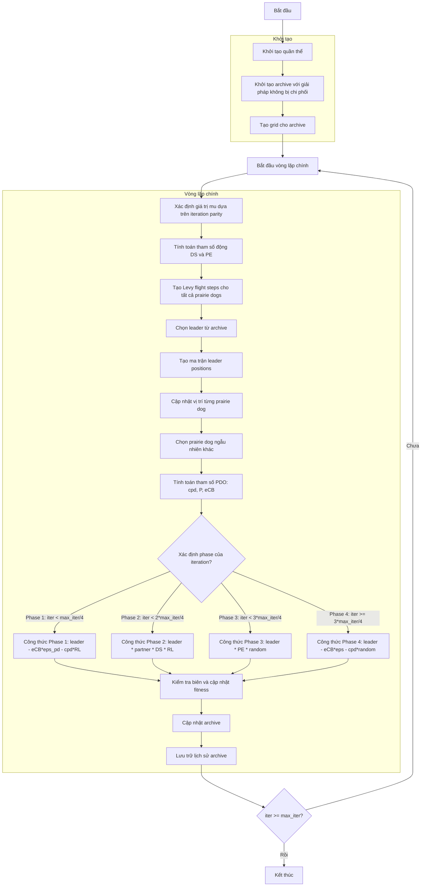

# Sơ đồ thuật toán Multi Objective Prairie Dogs Optimizer



### Giải thích chi tiết các bước:

1. **Khởi tạo quần thể**: 
   - Tạo ngẫu nhiên các vị trí ban đầu trong không gian tìm kiếm
   - Mỗi vị trí X_i ∈ [lb, ub]^dim
   - Tính toán giá trị hàm mục tiêu multi_fitness = objective_func(X_i)

2. **Khởi tạo archive với giải pháp không bị chi phối**:
   - Xác định các giải pháp không bị chi phối trong quần thể ban đầu
   - Thêm các giải pháp này vào archive bên ngoài

3. **Tạo grid cho archive**:
   - Tạo lưới hypercubes để quản lý archive
   - Gán chỉ số grid cho từng giải pháp trong archive

4. **Vòng lặp chính** (max_iter lần):
   - **Xác định giá trị mu dựa trên iteration parity**: 
     ```python
     mu = -1 if (iter + 1) % 2 == 0 else 1
     ```
   
   - **Tính toán tham số động DS và PE**:
     * DS (Digging Strength): Sức mạnh đào hang
     * PE (Predator Effect): Ảnh hưởng của kẻ săn mồi
     ```python
     DS = 1.5 * np.random.randn() * (1 - iter/max_iter) ** (2 * iter/max_iter) * mu
     PE = 1.5 * (1 - iter/max_iter) ** (2 * iter/max_iter) * mu
     ```
   
   - **Tạo Levy flight steps cho tất cả prairie dogs**: Tạo bước nhảy Levy flight
     ```python
     RL = np.array([self._levy_flight() for _ in range(search_agents_no)])
     ```
   
   - **Chọn leader từ archive**: Chọn leader từ archive sử dụng grid-based selection
   
   - **Tạo ma trận leader positions**: Tạo ma trận chứa vị trí leader cho tất cả prairie dogs
     ```python
     TPD = np.tile(leader.position, (search_agents_no, 1))
     ```
   
   - **Cập nhật vị trí từng prairie dog**: Duyệt qua từng prairie dog để cập nhật
   
   - **Chọn prairie dog ngẫu nhiên khác**: Chọn một prairie dog khác để so sánh
   
   - **Tính toán tham số PDO**: 
     * cpd: Tham số khác biệt cá nhân
     * P: Tham số vị trí tương đối
     * eCB: Tham số hiệu chỉnh dựa trên leader
     ```python
     cpd = np.random.rand() * (TPD[i, j] - population[k].position[j]) / (TPD[i, j] + self.eps)
     P = self.rho + (population[i].position[j] - np.mean(population[i].position)) / (TPD[i, j] * (self.ub[j] - self.lb[j]) + self.eps)
     eCB = leader.position[j] * P
     ```
   
   - **Xác định phase của iteration và áp dụng công thức tương ứng**:
     * **Phase 1 (0-25%)**: Khám phá mạnh
       ```python
       new_position[j] = leader.position[j] - eCB * self.eps_pd - cpd * RL[i, j]
       ```
     * **Phase 2 (25-50%)**: Kết hợp khám phá và khai thác
       ```python
       new_position[j] = leader.position[j] * population[k].position[j] * DS * RL[i, j]
       ```
     * **Phase 3 (50-75%)**: Khai thác mạnh
       ```python
       new_position[j] = leader.position[j] * PE * np.random.rand()
       ```
     * **Phase 4 (75-100%)**: Tinh chỉnh cuối
       ```python
       new_position[j] = leader.position[j] - eCB * self.eps - cpd * np.random.rand()
       ```
   
   - **Kiểm tra biên và cập nhật fitness**: Đảm bảo vị trí trong biên và tính fitness mới
   
   - **Cập nhật archive**: Thêm các giải pháp không bị chi phối mới vào archive
   
   - **Lưu trữ lịch sử archive**: Lưu trạng thái archive hiện tại

5. **Kết thúc**:
   - Lưu trữ kết quả cuối cùng
   - Trả về lịch sử archive và archive cuối cùng

### Tham số PDO:

**Tham số chính**:
- `rho` (0.005): Account for individual PD difference
- `eps_pd` (0.1): Food source alarm parameter  
- `eps` (1e-10): Small epsilon for numerical stability
- `beta` (1.5): Levy flight parameter

**Tham số động**:
- `DS`: Digging Strength - thay đổi theo iteration
- `PE`: Predator Effect - thay đổi theo iteration
- `mu`: Hệ số dựa trên parity của iteration

**Levy Flight**:
- Sử dụng hàm `levy_flight()` từ `_general.py`
- Giúp tăng khả năng khám phá không gian tìm kiếm
- Đặc biệt hiệu quả trong giai đoạn đầu của thuật toán
