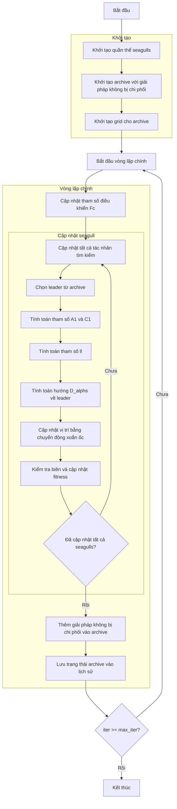

# Sơ đồ thuật toán Multi-Objective Seagull Optimizer



### Giải thích chi tiết các bước:

1. **Khởi tạo quần thể seagulls**:
   - Tạo ngẫu nhiên các vị trí ban đầu trong không gian tìm kiếm
   - Mỗi seagull có vị trí X_i ∈ [lb, ub]^dim

2. **Khởi tạo archive với giải pháp không bị chi phối**:
   - Xác định các giải pháp không bị chi phối trong quần thể ban đầu
   - Thêm các giải pháp này vào archive

3. **Khởi tạo grid cho archive**:
   - Tạo hypercubes để quản lý archive
   - Gán chỉ số grid cho từng giải pháp trong archive

4. **Cập nhật tham số điều khiển Fc**:
   - Tham số Fc giảm tuyến tính từ 2 về 0 theo số lần lặp
   ```python
   Fc = 2 - iter * (2 / max_iter)
   ```

5. **Chọn leader từ archive**:
   - Sử dụng grid-based selection để chọn leader từ archive
   - Nếu archive rỗng, chọn ngẫu nhiên từ quần thể
   ```python
   leader = self._select_leader()
   if leader is None:
       leader = np.random.choice(population)
   ```

6. **Tính toán tham số A1 và C1**:
   - A1: Tham số điều khiển hướng di chuyển
   - C1: Tham số điều khiển khoảng cách
   ```python
   r1 = np.random.random()
   r2 = np.random.random()
   A1 = 2 * Fc * r1 - Fc
   C1 = 2 * r2
   ```

7. **Tính toán tham số ll**:
   - Tham số ll cho chuyển động xoắn ốc
   ```python
   ll = (Fc - 1) * np.random.random() + 1
   ```

8. **Tính toán hướng D_alphs về leader**:
   - Tính toán hướng di chuyển về phía leader
   ```python
   D_alphs = Fc * member.position[j] + A1 * (leader.position[j] - member.position[j])
   ```

9. **Cập nhật vị trí bằng chuyển động xoắn ốc**:
   - Mô phỏng hành vi tấn công của seagull bằng chuyển động xoắn ốc
   ```python
   X1 = D_alphs * np.exp(ll) * np.cos(ll * 2 * np.pi) + leader.position[j]
   new_position[j] = X1
   ```

10. **Kiểm tra biên và cập nhật fitness**:
    - Đảm bảo vị trí nằm trong biên [lb, ub]
    - Tính toán giá trị fitness đa mục tiêu mới
    ```python
    new_position = np.clip(new_position, self.lb, self.ub)
    population[i].position = new_position
    population[i].multi_fitness = self.objective_func(new_position)
    ```

11. **Thêm giải pháp không bị chi phối vào archive**:
    - Thêm các giải pháp không bị chi phối mới vào archive
    - Loại bỏ các giải pháp bị chi phối
    ```python
    self._add_to_archive(population)
    ```

12. **Lưu trạng thái archive vào lịch sử**:
    - Lưu trữ bản sao của archive tại mỗi iteration
    ```python
    history_archive.append([member.copy() for member in self.archive])
    ```

13. **Kết thúc**:
    - Trả về lịch sử archive và archive cuối cùng
    - Hiển thị kết quả tối ưu hóa

### Hành vi mô phỏng của Seagull:
- **Giai đoạn di cư (Migration)**: Seagulls di chuyển về phía vị trí tốt nhất (leader)
- **Giai đoạn tấn công (Attacking)**: Seagulls sử dụng chuyển động xoắn ốc để tấn công con mồi
- **Tham số Fc**: Điều khiển sự cân bằng giữa khám phá (exploration) và khai thác (exploitation)
