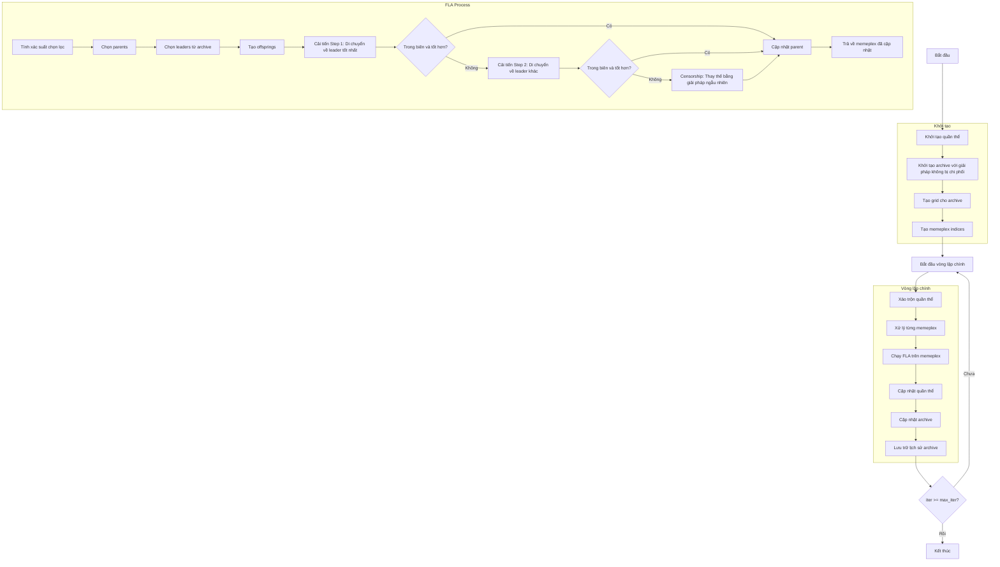

# Sơ đồ thuật toán Multi Objective Shuffled Frog Leaping Optimizer



### Giải thích chi tiết các bước:

1. **Khởi tạo quần thể**: 
   - Tạo ngẫu nhiên các vị trí ban đầu trong không gian tìm kiếm
   - Mỗi vị trí X_i ∈ [lb, ub]^dim
   - Tính toán giá trị hàm mục tiêu multi_fitness = objective_func(X_i)

2. **Khởi tạo archive với giải pháp không bị chi phối**:
   - Xác định các giải pháp không bị chi phối trong quần thể ban đầu
   - Thêm các giải pháp này vào archive bên ngoài

3. **Tạo grid cho archive**:
   - Tạo lưới hypercubes để quản lý archive
   - Gán chỉ số grid cho từng giải pháp trong archive

4. **Tạo memeplex indices**:
   - Chia quần thể thành các memeplex
   ```python
   memeplex_indices = np.arange(search_agents_no).reshape(self.n_memeplex, self.memeplex_size)
   ```

5. **Vòng lặp chính** (max_iter lần):
   - **Xáo trộn quần thể**: Trộn ngẫu nhiên quần thể (bước chính của SFLA)
   
   - **Xử lý từng memeplex**: Duyệt qua từng memeplex để tối ưu hóa
   
   - **Chạy FLA trên memeplex**: Thực hiện Frog Leaping Algorithm trên memeplex hiện tại
     * **Tính xác suất chọn lọc**: Tính toán xác suất chọn lọc dựa trên diversity grid
     * **Chọn parents**: Chọn q parents từ memeplex
     * **Chọn leaders từ archive**: Chọn leaders từ archive sử dụng grid-based selection
     * **Tạo offsprings**: Tạo α offsprings từ parents
     * **Cải tiến Step 1**: Di chuyển về phía leader tốt nhất
       ```python
       step = self.fla_sigma * np.random.random(self.dim) * (leaders[0].position - worst_parent.position)
       ```
     * **Cải tiến Step 2**: Di chuyển về phía leader khác nếu step 1 thất bại
     * **Censorship**: Thay thế bằng giải pháp ngẫu nhiên nếu cả hai step thất bại
   
   - **Cập nhật quần thể**: Cập nhật memeplex với kết quả từ FLA
   
   - **Cập nhật archive**: Thêm các giải pháp không bị chi phối mới vào archive
   
   - **Lưu trữ lịch sử archive**: Lưu trạng thái archive hiện tại

6. **Kết thúc**:
   - Lưu trữ kết quả cuối cùng
   - Trả về lịch sử archive và archive cuối cùng

### Chi tiết FLA (Frog Leaping Algorithm):

**Tham số FLA**:
- `fla_q`: Số lượng parents (mặc định: 30% kích thước memeplex)
- `fla_alpha`: Số lượng offsprings (mặc định: 3)
- `fla_beta`: Số lần lặp FLA tối đa (mặc định: 5)
- `fla_sigma`: Kích thước bước (mặc định: 2.0)

**Quy trình FLA**:
1. Tính xác suất chọn lọc dựa trên độ đa dạng grid
2. Chọn q parents từ memeplex
3. Chọn 3 leaders từ archive (sử dụng grid-based selection)
4. Tạo α offsprings:
   - Tìm worst parent trong selected parents
   - Step 1: Di chuyển về leader tốt nhất
   - Step 2: Di chuyển về leader khác nếu step 1 thất bại
   - Censorship: Tạo giải pháp ngẫu nhiên nếu cả hai step thất bại
5. Cập nhật memeplex với offsprings mới
