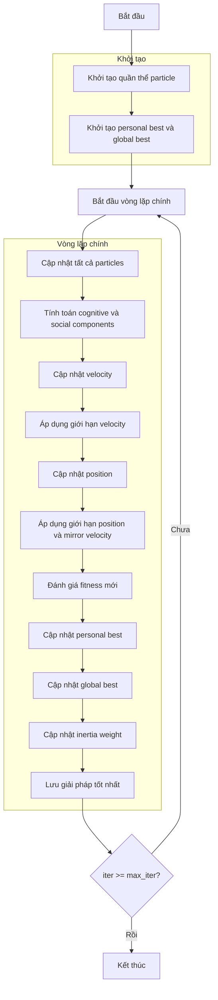

# Sơ đồ thuật toán Particle Swarm Optimizer



### Giải thích chi tiết các bước:

1. **Khởi tạo quần thể particle**: 
   - Tạo ngẫu nhiên các vị trí ban đầu trong không gian tìm kiếm
   - Khởi tạo velocity ngẫu nhiên trong giới hạn cho phép
   - Mỗi vị trí X_i ∈ [lb, ub]^dim
   - Tính toán giá trị hàm mục tiêu objective_func(X_i)

2. **Khởi tạo personal best và global best**:
   - Personal best của mỗi particle là bản sao của chính nó
   - Global best là particle có fitness tốt nhất trong quần thể

3. **Vòng lặp chính** (max_iter lần):
   - **Cập nhật tất cả particles**:
     * Mỗi particle cập nhật vị trí dựa trên velocity

   - **Tính toán cognitive và social components**:
     * Cognitive component: hướng về personal best
     * Social component: hướng về global best
     ```python
     cognitive_component = self.c1 * r1 * (personal_best[i].position - population[i].position)
     social_component = self.c2 * r2 * (global_best.position - population[i].position)
     ```

   - **Cập nhật velocity**:
     * Kết hợp inertia, cognitive và social components
     ```python
     population[i].velocity = (self.w * population[i].velocity + 
                             cognitive_component + 
                             social_component)
     ```

   - **Áp dụng giới hạn velocity**:
     * Đảm bảo velocity nằm trong [vel_min, vel_max]

   - **Cập nhật position**:
     * Di chuyển particle theo velocity
     ```python
     new_position = population[i].position + population[i].velocity
     ```

   - **Áp dụng giới hạn position và mirror velocity**:
     * Đảm bảo position nằm trong [lb, ub]
     * Nếu vượt biên, đảo ngược velocity
     ```python
     outside_bounds = (new_position < self.lb) | (new_position > self.ub)
     population[i].velocity[outside_bounds] = -population[i].velocity[outside_bounds]
     new_position = np.clip(new_position, self.lb, self.ub)
     ```

   - **Đánh giá fitness mới**:
     * Tính toán lại giá trị hàm mục tiêu

   - **Cập nhật personal best**:
     * Nếu fitness mới tốt hơn, cập nhật personal best

   - **Cập nhật global best**:
     * Nếu personal best mới tốt hơn global best, cập nhật global best

   - **Cập nhật inertia weight**:
     * Giảm inertia weight theo thời gian để chuyển từ khám phá sang khai thác
     ```python
     self.w *= self.wdamp
     ```

   - **Lưu giải pháp tốt nhất**:
     * Lưu trữ global best cho lịch sử tối ưu hóa

4. **Kết thúc**:
   - Lưu trữ kết quả cuối cùng
   - Hiển thị lịch sử tối ưu hóa
   - Trả về giải pháp tốt nhất và lịch sử
