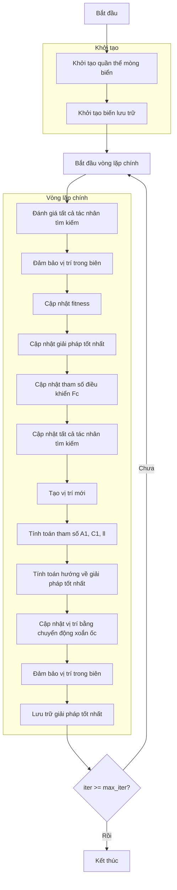

# Sơ đồ thuật toán Seagull Optimizer



### Giải thích chi tiết các bước:

1. **Khởi tạo quần thể mòng biển**:
   - Tạo ngẫu nhiên các vị trí ban đầu cho mòng biển
   - Mỗi mòng biển đại diện cho một giải pháp trong không gian tìm kiếm

2. **Khởi tạo biến lưu trữ**:
   - Khởi tạo lịch sử tối ưu hóa
   - Khởi tạo giải pháp tốt nhất ban đầu

3. **Vòng lặp chính** (max_iter lần):
   - **Đánh giá tất cả tác nhân tìm kiếm**:
     * Xử lý từng mòng biển trong quần thể
   
   - **Đảm bảo vị trí trong biên**:
     * Giữ vị trí mòng biển trong phạm vi [lb, ub]
     ```python
     population[i].position = np.clip(population[i].position, self.lb, self.ub)
     ```
   
   - **Cập nhật fitness**:
     * Tính toán giá trị hàm mục tiêu cho mỗi mòng biển
   
   - **Cập nhật giải pháp tốt nhất**:
     * So sánh và cập nhật nếu tìm thấy giải pháp tốt hơn
   
   - **Cập nhật tham số điều khiển Fc**:
     * Giảm tuyến tính từ 2 về 0 theo số lần lặp
     * Điều khiển sự cân bằng giữa khám phá và khai thác
     ```python
     Fc = 2 - iter * (2 / max_iter)
     ```
   
   - **Cập nhật tất cả tác nhân tìm kiếm**:
     * Cập nhật vị trí của từng mòng biển
   
   - **Tạo vị trí mới**:
     * Khởi tạo vị trí mới cho mỗi chiều
   
   - **Tính toán tham số A1, C1, ll**:
     * A1: Tham số điều khiển hướng di chuyển
     * C1: Tham số ngẫu nhiên
     * ll: Tham số cho chuyển động xoắn ốc
     ```python
     A1 = 2 * Fc * r1 - Fc
     C1 = 2 * r2
     ll = (Fc - 1) * np.random.random() + 1
     ```
   
   - **Tính toán hướng về giải pháp tốt nhất**:
     * Tính hướng di chuyển về phía giải pháp tốt nhất
     ```python
     D_alphs = Fc * member.position[j] + A1 * (best_solver.position[j] - member.position[j])
     ```
   
   - **Cập nhật vị trí bằng chuyển động xoắn ốc**:
     * Mô phỏng hành vi tấn công của mòng biển
     * Sử dụng hàm mũ và cosine để tạo chuyển động xoắn ốc
     ```python
     X1 = D_alphs * np.exp(ll) * np.cos(ll * 2 * np.pi) + best_solver.position[j]
     new_position[j] = X1
     ```
   
   - **Đảm bảo vị trí trong biên**:
     * Giữ vị trí mới trong phạm vi cho phép
   
   - **Lưu trữ giải pháp tốt nhất**:
     * Lưu lại giải pháp tốt nhất tại mỗi lần lặp

4. **Kết thúc**:
   - Lưu trữ kết quả cuối cùng
   - Hiển thị lịch sử tối ưu hóa
   - Trả về giải pháp tốt nhất
