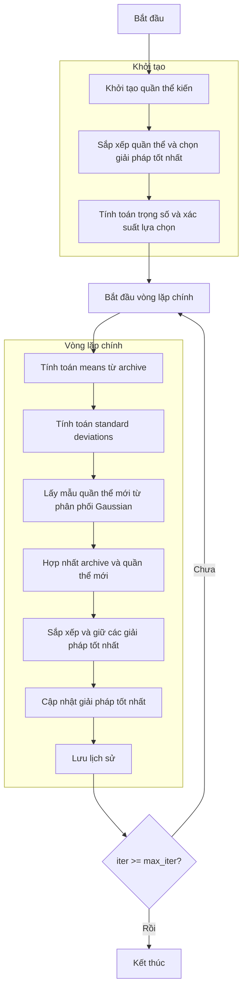

# Sơ đồ thuật toán Ant Colony Optimizer



### Giải thích chi tiết các bước:

1. **Khởi tạo quần thể kiến**: 
   - Tạo ngẫu nhiên các vị trí ban đầu trong không gian tìm kiếm
   - Mỗi vị trí X_i ∈ [lb, ub]^dim
   - Tính toán giá trị hàm mục tiêu objective_func(X_i)

2. **Sắp xếp quần thể và chọn giải pháp tốt nhất**:
   - Sắp xếp quần thể dựa trên fitness
   - Chọn giải pháp tốt nhất ban đầu

3. **Tính toán trọng số và xác suất lựa chọn**:
   - Tính trọng số Gaussian kernel cho từng giải pháp
   ```python
   w = (1 / (np.sqrt(2 * np.pi) * self.q * n_pop)) * 
        np.exp(-0.5 * (((np.arange(n_pop)) / (self.q * n_pop)) ** 2))
   ```
   - Tính xác suất lựa chọn
   ```python
   p = w / np.sum(w)
   ```

4. **Vòng lặp chính** (max_iter lần):
   - **Tính toán means từ archive**:
     * Lấy vị trí của tất cả các giải pháp trong archive
     ```python
     means = np.array([member.position for member in population])
     ```

   - **Tính toán standard deviations**:
     * Tính độ lệch chuẩn cho từng giải pháp dựa trên khoảng cách trung bình
     ```python
     for l in range(n_pop):
         D = np.sum(np.abs(means[l] - means), axis=0)
         sigma[l] = self.zeta * D / (n_pop - 1)
     ```

   - **Lấy mẫu quần thể mới từ phân phối Gaussian**:
     * Tạo giải pháp mới bằng cách lấy mẫu từ phân phối Gaussian
     * Với mỗi thành phần của giải pháp:
       - Chọn kernel Gaussian bằng roulette wheel selection
       - Tạo biến ngẫu nhiên Gaussian
       ```python
       l = self._roulette_wheel_selection(probabilities)
       new_position[i] = means[l, i] + sigma[l, i] * np.random.randn()
       ```
     * Kiểm tra biên và đánh giá fitness

   - **Hợp nhất archive và quần thể mới**:
     * Kết hợp archive hiện tại với quần thể mới

   - **Sắp xếp và giữ các giải pháp tốt nhất**:
     * Sắp xếp quần thể hợp nhất
     * Giữ lại chỉ các giải pháp tốt nhất (kích thước archive)

   - **Cập nhật giải pháp tốt nhất**:
     * So sánh và cập nhật nếu tìm thấy giải pháp tốt hơn

   - **Lưu lịch sử**:
     * Lưu trữ giải pháp tốt nhất hiện tại cho lịch sử tối ưu hóa

5. **Kết thúc**:
   - Lưu trữ kết quả cuối cùng
   - Hiển thị lịch sử tối ưu hóa
   - Trả về giải pháp tốt nhất và lịch sử
