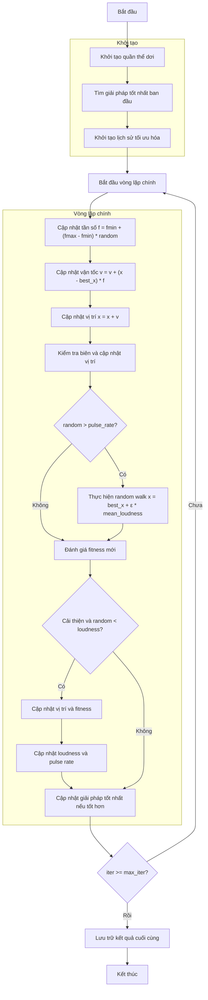

# Sơ đồ thuật toán Bat Optimizer



### Giải thích chi tiết các bước:

1. **Khởi tạo quần thể dơi**:
   - Tạo ngẫu nhiên các vị trí ban đầu trong không gian tìm kiếm
   - Mỗi dơi có các tham số: vị trí, fitness, tần số, vận tốc, loudness, pulse_rate
   - Tính toán giá trị hàm mục tiêu objective_func(position)

2. **Tìm giải pháp tốt nhất ban đầu**:
   - Sắp xếp quần thể và chọn giải pháp tốt nhất làm best_solver

3. **Khởi tạo lịch sử tối ưu hóa**:
   - Khởi tạo danh sách lưu trữ lịch sử các giải pháp tốt nhất

4. **Vòng lặp chính** (max_iter lần):
   - **Cập nhật tần số**:
     * Mỗi dơi cập nhật tần số ngẫu nhiên trong khoảng [fmin, fmax]
     ```python
     frequency = fmin + (fmax - fmin) * np.random.random()
     ```

   - **Cập nhật vận tốc**:
     * Cập nhật vận tốc hướng về giải pháp tốt nhất
     ```python
     velocity = velocity + (position - best_solver.position) * frequency
     ```

   - **Cập nhật vị trí**:
     * Di chuyển dơi theo vận tốc mới
     ```python
     new_position = position + velocity
     ```

   - **Kiểm tra biên**:
     * Đảm bảo vị trí nằm trong biên [lb, ub]

   - **Random walk**:
     * Với xác suất (1 - pulse_rate), thực hiện bước đi ngẫu nhiên
     ```python
     if np.random.random() > pulse_rate:
         epsilon = -1 + 2 * np.random.random()
         new_position = best_solver.position + epsilon * mean_loudness
     ```

   - **Đánh giá fitness mới**:
     * Tính toán giá trị hàm mục tiêu cho vị trí mới

   - **Cập nhật giải pháp**:
     * Nếu giải pháp mới tốt hơn và đáp ứng điều kiện loudness
     ```python
     if self._is_better(new_bat, population[i]) and np.random.random() < loudness:
         # Cập nhật vị trí và fitness
         # Cập nhật loudness và pulse rate
         loudness = alpha * loudness
         pulse_rate = ro * (1 - np.exp(-gamma * iter))
     ```

   - **Cập nhật giải pháp tốt nhất**:
     * So sánh và cập nhật nếu tìm thấy giải pháp tốt hơn

5. **Kết thúc**:
   - Lưu trữ kết quả cuối cùng
   - Hiển thị lịch sử tối ưu hóa
   - Trả về giải pháp tốt nhất và lịch sử
