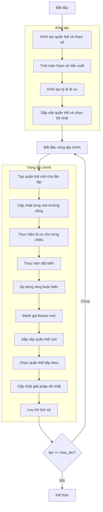

# Sơ đồ thuật toán Biogeography Based Optimizer



### Giải thích chi tiết các bước:

1. **Khởi tạo quần thể và tham số**:
   - Tạo ngẫu nhiên các môi trường sống ban đầu
   - Thiết lập các tham số thuật toán:
     * Tỷ lệ giữ lại (keep_rate)
     * Hệ số di cư (alpha)
     * Xác suất đột biến (p_mutation)
     * Kích thước bước đột biến (sigma)

2. **Tính toán tham số dẫn xuất**:
   - Tính số lượng môi trường sống cần giữ lại
   - Tính số lượng môi trường sống mới
   ```python
   n_keep = round(self.keep_rate * search_agents_no)
   n_new = search_agents_no - n_keep
   ```

3. **Khởi tạo tỷ lệ di cư**:
   - Tỷ lệ di cư ra (emigration rates) giảm dần
   - Tỷ lệ di cư vào (immigration rates) tăng dần
   ```python
   mu = np.linspace(1, 0, search_agents_no)
   lambda_rates = 1 - mu
   ```

4. **Sắp xếp quần thể và chọn tốt nhất**:
   - Sắp xếp môi trường sống theo độ thích nghi
   - Chọn giải pháp tốt nhất ban đầu

5. **Vòng lặp chính** (max_iter lần):
   - **Tạo quần thể mới cho lần lặp**:
     * Sao chép quần thể hiện tại
   
   - **Cập nhật từng môi trường sống**:
     * Xử lý từng môi trường sống riêng lẻ
   
   - **Thực hiện di cư cho từng chiều**:
     * Nếu số ngẫu nhiên ≤ tỷ lệ di cư vào:
       * Tính xác suất di cư ra (loại trừ môi trường hiện tại)
       * Chọn môi trường nguồn bằng bánh xe roulette
       * Thực hiện di cư với hệ số alpha
       ```python
       new_population[i].position[k] = population[i].position[k] + self.alpha * (population[j].position[k] - population[i].position[k])
       ```
   
   - **Thực hiện đột biến**:
     * Nếu số ngẫu nhiên ≤ xác suất đột biến:
       * Thêm nhiễu Gaussian với độ lệch sigma
   
   - **Áp dụng ràng buộc biên**:
     * Đảm bảo vị trí nằm trong biên [lb, ub]
   
   - **Đánh giá fitness mới**:
     * Tính toán giá trị hàm mục tiêu mới
   
   - **Sắp xếp quần thể mới**:
     * Sắp xếp môi trường sống theo độ thích nghi
   
   - **Chọn quần thể tiếp theo**:
     * Giữ lại các môi trường tốt nhất + các môi trường mới
     ```python
     next_population = sorted_population[:n_keep] + sorted_new_population[:n_new]
     ```
   
   - **Cập nhật giải pháp tốt nhất**:
     * So sánh và cập nhật nếu tìm thấy giải pháp tốt hơn
   
   - **Lưu trữ lịch sử**:
     * Lưu lại giải pháp tốt nhất tại mỗi lần lặp

6. **Kết thúc**:
   - Lưu trữ kết quả cuối cùng
   - Hiển thị lịch sử tối ưu hóa
   - Trả về giải pháp tốt nhất
